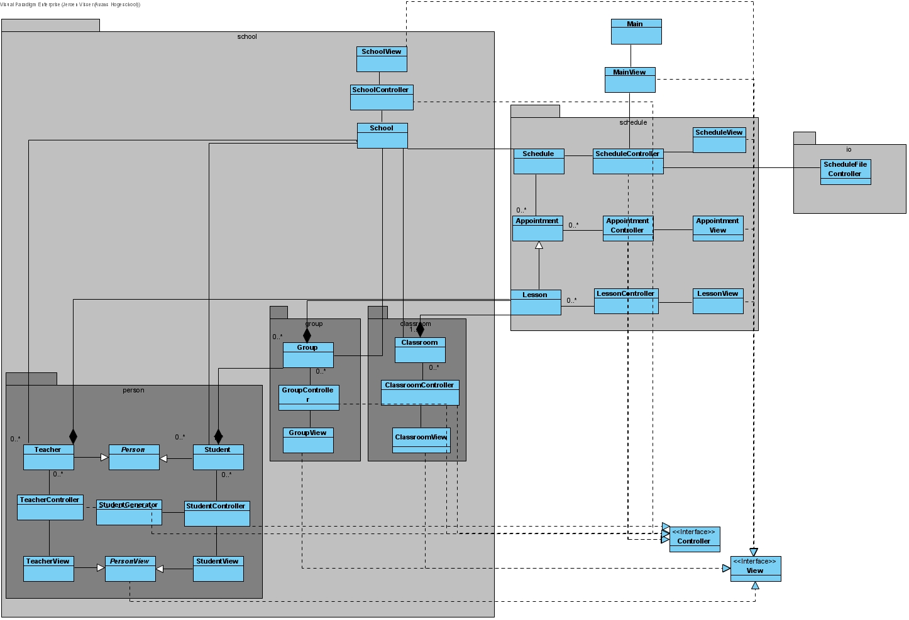
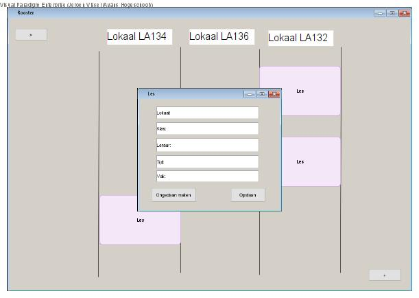

# Portfolio Jeroen Visser (2149954)

## Week reflecties

### Week 3
Dit is nog steeds een van de eerdere weken wat betreft de proftaak. Er is hiervoor al het een en het ander gedaan om een klassen diagram te ontwerpen. Deze week worden de klassen ook daadwerkelijk in code aangemaakt. Het klassendiagram dat wij hebben gemaakt is hieronder te zien.

Nu iedereen in de proftaak groep dit ontwerp als basis heeft zal er per tweetal worden gewerkt aan een bepaalde package. Ik heb mij, samen met Jochem, bezig gehouden aan de Person package.

Als eerst zijn we begonnen aan het afmaken van de Student en Teacher klassen. We hebben gemerkt dat we soms dezelfde code aan typen waren in deze twee klassen. Bijvoorbeeld de code die hieronder staat. Deze code regelt het controleren of de waarde die zijn ingevuld door de gebruiker om een persoon toe te voegen ook valide zijn. Deze duplicate code hebben we kunnen verhelpen door deze code naar de super klasse Person te verplaatsen. Wij hebben deze keuze gemaakt omdat dit ervoor zorgt dat de code een stuk netter is. Daarbij is het ook makkelijk om nog een nieuw soort Person toe te voegen, mocht dat er ooit van komen.

~~~java
public abstract class PersonController {

boolean personIsValid(PersonView view) {
        try {
            return !(view.getNameField().getText().isEmpty() || view.getAgeField().getText().isEmpty() ||
                    view.getGenderField().getText().isEmpty()  || Integer.parseInt(view.getAgeField().getText()) < 1);

        } catch(Exception e) {
            return false;
        }
    }
}
~~~

Verder zijn we ook beggonnen aan de StudentGenerator klasse. Deze klasse kan een x aantal studenten automatisch genereren met een naam en random gegevens. Er waren twee opties als het ging over de namen. We kunnen deze namelijk hard code in de applicatie zetten, of we lezen ze in van een .txt bestand. Bijde hebben voordelen en nadelen. Daarom zijn we uiteindelijk tot de conclusie gekomen om een combinatie van de twee te doen.
We hebben ervoor gekozen om een combinatie te doen voor de volgende reden. Door een .txt bestand te hebben blijft de mogelijkheid altijd open om extra namen gemakkelijk toe te voegen. Daarentegen hebben we ook hard code namen zodat er altijd studenten gegenereerd kunnen worden, zelfs al het inlezen van het .txt bestand niet zou lukken.

In de onderstaande code is de StudentGenerator klasse te zien. Deze leest het .txt bestand in met namen. Als er te weinig namen instaan worden deze aangevuld met de hard code namen. Als er teveel instaan worden ze simpelweg niet toegevoegd.

~~~java
public class StudentGenerator {

public StudentGenerator(short amount) {
        this.names = NameFile.readFile();
        for (int i = 0; i < amount; i +=  50){
            Group group = new Group("Groep " + i / 50);
            groups.add(group);
            SchoolFile.getSchool().getGroups().add(group);
        }

        for(int i = this.names.size(); i < amount; i++) {
            this.addName();
        }

        while(amount < this.names.size()) {
            this.removeName();
        }

        this.addStudents();
    }
}
~~~

### Week 4
Deze week heb ik meer problemen opgelost dan nieuwe code gemaakt. Samen met Luuk heb ik redelijk veel tijd besteed aan het refactoren van code. Een groot probleem waar we hier tegenaanliepen is dat de drie verschillende tweetallen hun code anders hadden ingedeeld en gemaakt. Dit zorgde ervoor dat er na het mergen een aantal grote fouten en veel kleine foutjes waren.

Één van de dingen waar ik aan gewerkt heb is bijvoorbeeld de layout van de GUI. Er is een ontwerp gemaakt van de GUI namelijk deze:

Zoals hier te zien is was het de bedoeling dat de input velden allemaal gecentreerd zouden staan. Dat was in de praktijk alleen bij bijna niemand gebeurt. Dit samen met andere dingen zoals verschil in naamgeving van knoppen en werking van knoppen heeft mij een aantal uur refactoren gekost.
Een ander ding waar ik tegenaanliep tijdens het oplossen van de GUI layout was code die suboptimaal was. Bijvoorbeeld het overbodig nesten van layout managers. Ook dit heb ik toen bij veel klassen nog gerefactored om de code netjes en overzichtelijk te houden.

Verder is er nu ook de afspraak gemaakt om gerbuik te gaan maken van de Github issues. Op deze manier heeft iedereen een overzicht van dingen die nog gemaakt of verbeterd moeten worden.

### Week 5
Het eerste wat ik deze week heb gedaan is verder gaan met het refactoren van de rooster module. Een groot ding waar ik mij mee bezig heb gehouden was de netheid en uitbreidbaarheid van de code. Iets wat ik veel tegenkwam is methode die soms 60 regels lang waren. Dit vond ik nogal overbodig en is meestal een teken dat dit opgesplitst moet worden in meerdere apparte methode.

Verder heb ik op heel veel plekken het "this" keyword toe moeten voegen. Dit wordt heel vaak vergeten en is ook gemeld bij de vergaderingen. Daarbij heb ik ook bij een aantal klassen javadocs toegevoegd zodat andere mensen snel kunnen zien wat een methode doet.

### Week 6
Deze week was ik helaas ziek en niet in staat om mee te helpen aan de proftaak. Ik heb deze week dus ook geen bijdrage geleverd aan de voortgang van het project.

### Week 7
Deze week heb ik meegeholpen met het verbeteren van de werking van de NPC en het toevoegen van de "naar huis" feature voor de NPC.

Het probleem waar we tegenaan liepen was dat de NPC te snel rond draaiden als de tijd versneld werd. Dit zorgde ervoor dat de NPC hun doel zouden overschieten en buiten de muren van de map belandde. Er is nagedacht over twee opties. 
- Optie 1: limiteer de tijd versnelling tot een lager getal zodat het probleem niet voorkomt.
- Optie 2: zorg ervoor dat als de NPC zijn doel overschiet dat hij wordt terug gezet naar zijn doel.

Optie 1 is natuurlijk een stuk makkelijker te implementeren, maar in prenciepe is het probleem dan niet opgelost. Het probleem is alleen verborgen. Er is besloten om de code zo goed mogelijk te maken als we kunnen en daarom is er uiteindelijk gekozen voor optie 2.

Nadat de aard van het probleem was gevonden hebben we het alsnog vrij simpel op kunnen lossen door een simpele if statment. Als de rotatie verder gaat de het doel word de NPC simpelweg weer op het doel gezet.

~~~java
public abstract class NPC {

    public void update(double deltaTime) {
        if (rotation < -(this.rotationSpeed * 100 * deltaTime)) {
            this.angle -= this.rotationSpeed * 100 * deltaTime;
        } else if (rotation > this.rotationSpeed * 100 * deltaTime) {
            this.angle += this.rotationSpeed * 100 * deltaTime;
        } else {
            this.angle = targetAngle;
        }
    }
}
~~~

Verder heb ik deze week ook meegeholpen aan de feature om de NPC's om 17.00 uur naar huis te laten gaan. Dit komt er in prenciepe op neer dat alle NPC's om 17.00 uur terug lopen naar de ingang van het gebouw.

We hebben dit kunnen doen door voor elke NPC een soort van "onzichtbare" afspraak in te roosteren bij de ingang. Op deze manier gaan alle NPC's naar de ingang om 17.00 uur. Een feature wat ik nog graag toe zou willen voegen is dat de NPC's ook niet meer visible zijn als ze de uitgang hebben bereikt.
 
## Stelling en mijn reflectie daarop
De stelling : "In het bedrijfsleven wordt steeds meer in software gesimuleerd"

Naar mijn mening is dit inderdaad een stelling die waar is. Nu dat computers steeds meer kunnen en steeds sneller zijn is het voor bedrijven heel aantrekkelijk om simulaties te gaan gebruiken voor een veelvoud van dingen. Je kan hierbij bijvoorbeeld denken aan het ontwerpen van een nieuw product. Dit product kan nu ontworpen en gesimuleerd worden op een computer. Op deze manier kunnen ontwerpfouten al gevonden worden voordat het product ooit fysiek gemaakt is. Zeker in de huidige tijd is dit veel goedkoper dan het constant maken van foutive producten.

Het gebruik van simulaties in het bedrijfsleven houdt niet op bij het ontwerpen van simpele producten. Denk bijvoorbeeld ook aan een groot gebouw. Hoe weten de architecten of de warmte in de zomer maanden wel goed kan worden afgevoerd. Hier worden ook simulatie modelen voor gebruikt. Dit is een stuk goedkoper en sneller dan miniaturen bouwen en voorzien van sensoren elke keer als er een verandering komt in het ontwerp.

Daarnaast worden simulaties ook veel gebruikt om mensen bepaalde vaardigheden aan te leren die anders gevaarlijk kunnen zijn. Denk bijvoorbeeld aan een piloot. Deze persoon heeft weken in een simulator besteed voordat hij ook maar 1 keer een echt vliegtuig heeft bestuurd.

Simulaties zijn in staat om een complex ontwerp uit te testen op manieren die heel moeilijk of soms gevaarlijk zouden zijn in het echt. Bijvoorbeeld ook de kracht die nodig is om een een nieuw ontwerp van een stalen balk te testen. In het echt zou hier dan gewerkt moeten worden met zeer zwaar en krachtig materiaal, er zijn dus veel manieren waarop dit fout kan gaan.

Er is alleen wel een probleem met het testen door gebruik van simulaties. Wanneer je een product simuleert ga je ervan uit dat dat product is zoals het ontworpen is. Er wordt dus bij een simulatie weinig tot geen rekening gehouden met eventuele productie fouten. Zo kan een bepaald product in een simulatie misschien perfect zijn maar als er een fout zit in de productie zal het nooit zo zijn als dat het ontworpen is. Daarom zal er altijd nog moeten worden getest met fysieke producten.

Kortom simulaties worden al heel veel gerbuikt in het bedrijfsleven en ik denk dat dit alleen nog maar meer zal worden naar mate computers sneller en betaalbaarder worden.

(Groot, 2015)

## Applicaties die gebruik maken van JSON en waarom
JSON is een manier om data over te brengen van een computer naar een andere computer, of om data op te slaan. Het is een lichtgewicht format die al op veel plekken wordt gebruikt en ondersteund. Een heel groot voordeel dat JSON heeft is dat het ook makkelijk leesbaar is voor mensen. Hierdoor is het mogelijk om te zien wat een JSON bestand bevat zonder dat het geparsed moet worden naar een andere vorm.

Het grootste voordeel dat JSON heeft in het heden is denk ik toch dat het op heel veel plekken ondersteund is, want hoe makkelijk het ook is om te gebruiken, als het nergens wordt ondersteund dan heb je er eigenlijk alsnog niks aan.

### Een paar voorbeelden waaar JSON wordt gebruikt
- Tiled, voor het opslaan van de maps gemaakt door de gebruiker.
- Minecraft, voor het opslaan van tekst in boeken en custom namen.
- Excel, voor het inporteren van data uit een website.
- Steam, voor het overbrengen van data uit de steam web api.

## Bronnen

Groot, M. (2015, 9 april). Hoe kan simulatie software bijdragen aan betere innovaties? design solutions. https://blog.designsolutions.nl/hoe-kan-simulatie-software-bijdragen-aan-betere-innovaties