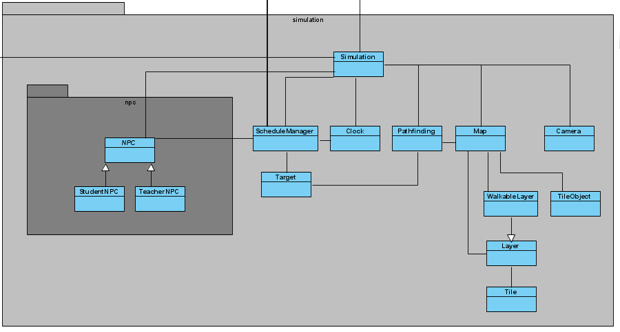

# Lieselotte Sihasale
Studentnummer: 2167072
<br/>Groep: B1

# Inhoud
* [Inleiding](#inleiding)
* [Algemeen](#algemeen)
* [Week 3](#week-3)
* [Week 4](#week-4)
* [Week 5](#week-5)
* [Week 6](#week-6)
* [Week 7](#week-7)
* [Conclusie](#conclusie)
* [JSON applicaties](#JSON-applicaties)


## Inleiding
Dit is de individuele opdracht voor de proftaak festival planner van periode 3 
van Lieselotte Sihasale. In dit document zal beschreven worden waar ik 
tegenaan gelopen ben en wat ik ervan heb geleerd. Elke week zal apart besproken 
worden.


## Algemeen
We hebben in dit project gewerkt volgens het *NVC model*. 


Het idee was om een Interface voor Controller en View te hebben en hier vervolgens overerving op toe 
te passen. Wij hebben de Data klasse, controller klasse en View klasse van dezelfde onderdelen (bv. Schedule)
bij elkaar gehouden in dezelfde package. Dit leek in het begin handig, later bleek dat dit zorgde voor grote 
en onoverzichtelijke packages

Dit software model was nieuw voor mij en ik heb er gemengde gevoelens over. Ook was het lastig
om te begrijpen hoe het nou precies werkte in het begin, maar dit werd later, toen ik 
er eenmaal mee bezig was steeds duidelijker. Dit model is opzich best handig, maar
ik vind het niet per se heel overzichtelijk. Het drie-lagen model dat we gebruikt 
hebben voor de BoeBot vond ik fijner werken. Dat gaf me ook meer overzicht en 
meer het idee dat ik wist waar ik precies mee bezig was. 


## Week 3
### Reflectie


In week 3 heb ik samen met Luuk de klassen *AppointmentView* en *LessonView*
afgemaakt. We waren al aan de schedule package begonnen in week 2. De 
*AppointmentView* en LessonView zitten in de schedule package. Deze hele package 
heb ik samen met Luuk gemaakt. Waar we het meeste tegenaan liepen was het overerven 
van de view klassen. Wij vonden dit lastig om dit goed te implementeren, omdat er 
wel dingen dubbel waren in de views, maar niet alles en dat maakte het lastig om de 
overerving goed te implementeren. Nadat iedereen zijn of haar deel af had, begonnen 
we met mergen naar de developer branch. Dit ging niet helemaal goed. Iedereen had 
dummy methodes aangemaakt voor klassen die ze nodig hadden voor hun eigen deel. Dit 
zorgde voor veel merge conflicten en andere problemen. Niets werkte goed samen. 
Dit resulteerde in twee weken refactoren voordat het fatsoenlijk werkte. Hier heb ik
zelf niet heel veel aan gedaan en wat ik gedaan heb, ging makkelijk.

### Wat heb ik ervan geleerd?
Ik heb deze week geleerd om beter af te spreken hoe alles met elkaar samen moet gaan werken
voordat er überhaupt geprogrammeerd wordt. Dit zal heel veel merge conflicts voorkomen
en ook de twee weken lange refactor zal hiermee grotendeels voorkomen zijn. Ook is het
waarschijnlijk handiger om één branch tegelijk te mergen in plaats van alles in één keer.


## Week 4
### Reflectie
Ik week 4 hebben we uitgezocht hoe we een tilemap kunnen inladen in onze simulator.
Dit leverde best veel problemen op vanwege de verschillen in de json file van 
de docent en die van ons. Ik heb met Casper het begin gemaakt aan het inlezen van 
de tilemap. Wij liepen echter vast bij de juiste tiles op de juiste plek tekenen.
Hier zijn Casper, Jochem en Tom uiteindelijk mee verder gegaan, terwijl ik met 
Luuk verder ben gegaan aan de refactor van de rooster module.

Hieronder zie je het layer object uit onze JSON file met 1 layer. 
```json
"layers":[
        {
         "data":[136, 137, 24, 25, 25, 25, 26, 135, 136, 136, 136, 136, 136, 136, 136, 136, 136, 136, 136, 136, 136, 136, 136, 136, 136, 136, 136, 136, 136, 136, 136, 136, 136, 136, 136, 136, 136, 136, 136, 136, 136, 136, 136, 136, 136, 136, 136, 136, 136, 136, 136, 136, 136, 136, 136, 136, 136, 136, 136, 136, 136, 136, 136, 136, 136, 136, 136, 136, 136, 136, 136, 136, 136, 136, 136, 136, 136, 136, 136, 136, 136, 136, 136, 136, 136, 136, 136, 136, 136, 136, 136, 136, 136, 136, 136, 136, 136, 136, 136, 136, 136, 137, 24, 25, 25, 25, 26, 135, 136, 136, 136, 136, 136, 136, 136, 136, 136, 136, 136, 136, 136, 136, 136, 136, 136, 136, 136, 136, 136, 136, 136, 136, 136, 136, 136, 136, 136, 136, 136, 136, 136, 136, 136, 136, 136, 136, 136, 136, 136, 136, 136, 136, 136, 136, 136, 136, 136, 136, 136, 136, 136, 136, 136, 136, 136, 136, 136, 136, 136, 136, 136, 136, 136, 136, 136, 136, 136, 136, 136, 136, 136, 136, 136, 136, 136, 136, 136, 136, 136, 136, 136, 136, 136, 136, 136, 136, 136, 136, 136, 136, 136, 137, 69, 70, 70, 70, 71, 135, 136, 136, 136, 136, 136, 136, 136, 136, 136, 136, 136, 136, 136, 136, 136, 136, 136, 136, 136, 136, 136, 136, 136, 136, 136, 136, 136, 136, 136, 136, 136, 136, 136, 136, 136, 136, 136, 136, 136, 136, 136, 136, 136, 136, 136, 136, 136, 136, 136, 136, 136, 136, 136, 136, 136, 136, 136, 136, 136, 136, 136, 136, 136, 136, 136, 136, 136, 136, 136, 136, 136, 136, 136, 136, 136, 136, 136, 136, 136, 136, 136, 136, 136, 136, 136, 136, 136, 136, 136, 136, 136, 136, 136, 137, 69, 70, 70, 70, 71, 135, 136, 136, 136, 136, 136, 136, 136, 136, 136, 136, 136, 136, 136, 136, 136, 136, 136, 136, 136, 136, 136, 136, 136, 136, 136, 136, 136, 136, 136, 136, 136, 136, 136, 136, 136, 136, 136, 136, 136, 136, 136, 136, 136, 136, 136, 136, 136, 136, 136, 136, 136, 136, 136, 136, 136, 136, 136, 136, 136, 136, 136, 136, 136, 136, 136, 136, 136, 136, 136, 136, 136, 136, 136, 136, 136, 136, 136, 136, 136, 136, 136, 136, 136, 136, 136, 136, 136, 136, 136, 136, 136, 136, 136, 137, 69, 70, 70, 70, 71, 135, 136, 136, 158, 158, 158, 158, 158, 158, 158, 158, 158, 158, 158, 158, 158, 158, 158, 158, 158, 158, 158, 158, 158, 158, 158, 158, 158, 158, 158, 158, 155, 136, 136, 156, 158, 158, 158, 158, 158, 158, 158, 158, 158, 158, 158, 158, 158, 158, 158, 158, 158, 158, 158, 158, 158, 158, 158, 158, 158, 158, 158, 158, 158, 158, 158, 158, 158, 158, 158, 158, 155, 136, 136, 136, 136, 136, 136, 136, 136, 136, 136, 136, 136, 136, 136, 136, 136, 136, 136, 136, 136, 136, 136, 137, 69, 70, 70, 70, 71, 135, 136, 137, 12, 13, 13, 13, 13, 13, 13, 13, 13, 13, 13, 13, 13, 13, 13, 13, 13, 13, 13, 13, 13, 13, 13, 13, 13, 13, 13, 14, 135, 136, 136, 137, 12, 13, 13, 13, 13, 13, 13, 13, 13, 13, 13, 13, 13, 13, 13, 13, 13, 13, 13, 13, 13, 13, 13, 13, 13, 13, 13, 13, 13, 13, 13, 13, 13, 13, 13, 14, 135, 136, 136, 136, 136, 136, 136, 136, 136, 136, 136, 136, 136, 136, 136, 136, 136, 136, 136, 136, 136, 136, 136, 137, 69, 70, 70, 70, 71, 135, 136, 137, 34, 35, 35, 35, 35, 35, 35, 35, 35, 35, 35, 35, 35, 35, 35, 35, 35, 35, 35, 35, 35, 35, 35, 35, 35, 35, 35, 36, 135, 136, 136, 137, 34, 35, 35, 35, 35, 35, 35, 35, 35, 35, 35, 35, 35, 35, 35, 35, 35, 35, 35, 35, 35, 35, 35, 35, 35, 35, 35, 35, 35, 35, 35, 35, 35, 35, 35, 36, 135, 136, 136, 136, 136, 136, 136, 136, 136, 136, 136, 136, 136, 136, 136, 136, 136, 136, 136, 136, 136, 136, 136, 137, 46, 47, 47, 47, 48, 135, 136, 137, 56, 57, 57, 57, 57, 57, 57, 57, 57, 57, 57, 57, 57, 57, 57, 57, 57, 57, 57, 57, 57, 57, 57, 57, 57, 57, 57, 58, 135, 136, 136, 137, 56, 57, 57, 57, 57, 57, 57, 57, 57, 57, 57, 57, 57, 57, 57, 57, 57, 57, 57, 57, 57, 57, 57, 57, 57, 57, 57, 57, 57, 57, 57, 57, 57, 57, 57, 58, 135, 136, 136, 136, 136, 136, 136, 136, 136, 136, 136, 136, 136, 136, 136, 136, 136, 136, 136, 136, 136, 136, 136, 137, 49, 49, 49, 49, 49, 135, 136, 137, 49, 49, 49, 49, 49, 49, 49, 49, 49, 49, 49, 49, 49, 49, 49, 49, 49, 49, 49, 49, 49, 49, 49, 49, 49, 49, 49, 49, 135, 136, 136, 137, 49, 49, 49, 49, 49, 49, 49, 49, 49, 49, 49, 49, 49, 49, 49, 49, 49, 49, 49, 49, 49, 49, 49, 49, 49, 49, 49, 49, 49, 49, 49, 49, 49, 49, 49, 49, 135, 136, 136, 136, 136, 136, 136, 136, 136, 136, 136, 136, 136, 136, 136, 136, 136, 136, 136, 136, 136, 136, 136, 137, 49, 49, 49, 49, 49, 135, 136, 137, 49, 2, 3, 3, 3, 3, 3, 3, 3, 3, 3, 3, 3, 3, 3, 3, 3, 3, 3, 3, 3, 3, 3, 3, 3, 3, 4, 49, 135, 136, 136, 137, 49, 2, 3, 3, 3, 3, 3, 3, 3, 3, 3, 3, 3, 3, 3, 3, 3, 3, 3, 3, 3, 3, 3, 3, 3, 3, 3, 3, 3, 3, 3, 3, 3, 3, 4, 49, 135, 136, 136, 136, 136, 136, 136, 136, 136, 136, 136, 136, 136, 136, 136, 136, 136, 136, 136, 136, 136, 136, 136, 137, 49, 49, 49, 49, 49, 135, 136, 137, 49, 24, 25, 25, 25, 25, 25, 25, 25, 25, 25, 25, 25, 25, 25, 25, 25, 25, 25, 25, 25, 25, 25, 25, 25, 25, 26, 49, 135, 136, 136, 137, 49, 24, 25, 25, 25, 25, 25, 25, 25, 25, 25, 25, 25, 25, 25, 25, 25, 25, 25, 25, 25, 25, 25, 25, 25, 25, 25, 25, 25, 25, 25, 25, 25, 25, 26, 49, 135, 136, 136, 136, 136, 136, 136, 136, 136, 136, 136, 136, 136, 136, 136, 136, 136, 136, 136, 136, 136, 136, 136, 137, 49, 49, 49, 49, 49, 135, 136, 137, 49, 24, 25, 25, 25, 25, 25, 25, 25, 25, 25, 25, 25, 25, 25, 25, 25, 25, 25, 25, 25, 25, 25, 25, 25, 25, 26, 49, 135, 136, 136, 137, 49, 24, 25, 25, 25, 25, 25, 25, 25, 25, 25, 25, 25, 25, 25, 25, 25, 25, 25, 25, 25, 25, 25, 25, 25, 25, 25, 25, 25, 25, 25, 25, 25, 25, 26, 49, 135, 136, 136, 136, 136, 136, 136, 136, 136, 136, 136, 136, 136, 136, 136, 136, 136, 136, 136, 136, 136, 136, 136, 137, 49, 49, 49, 49, 49, 135, 136, 137, 49, 24, 25, 25, 25, 25, 25, 25, 25, 25, 25, 25, 25, 25, 25, 25, 25, 25, 25, 25, 25, 25, 25, 25, 25, 25, 26, 49, 135, 136, 136, 137, 49, 24, 25, 25, 25, 25, 25, 25, 25, 25, 25, 25, 25, 25, 25, 25, 25, 25, 25, 25, 25, 25, 25, 25, 25, 25, 25, 25, 25, 25, 25, 25, 25, 25, 26, 49, 135, 136, 136, 136, 136, 136, 136, 136, 136, 136, 136, 136, 136, 136, 136, 136, 136, 136, 136, 136, 136, 136, 136, 137, 49, 49, 49, 49, 49, 135, 136, 137, 49, 24, 25, 25, 25, 25, 25, 25, 25, 25, 25, 25, 25, 25, 25, 25, 25, 25, 25, 25, 25, 25, 25, 25, 25, 25, 26, 49, 135, 136, 136, 137, 49, 24, 25, 25, 25, 25, 25, 25, 25, 25, 25, 25, 25, 25, 25, 25, 25, 25, 25, 25, 25, 25, 25, 25, 25, 25, 25, 25, 25, 25, 25, 25, 25, 25, 26, 49, 135, 136, 136, 136, 136, 136, 136, 136, 136, 136, 136, 136, 136, 136, 136, 136, 136, 136, 136, 136, 136, 136, 136, 137, 49, 49, 49, 49, 49, 135, 136, 137, 49, 24, 25, 25, 25, 25, 25, 25, 25, 25, 25, 25, 25, 25, 25, 25, 25, 25, 25, 25, 25, 25, 25, 25, 25, 25, 26, 49, 135, 136, 136, 137, 49, 24, 25, 25, 25, 25, 25, 25, 25, 25, 25, 25, 25, 25, 25, 25, 25, 25, 25, 25, 25, 25, 25, 25, 25, 25, 25, 25, 25, 25, 25, 25, 25, 25, 26, 49, 135, 136, 136, 136, 136, 136, 136, 136, 136, 136, 136, 136, 136, 136, 136, 136, 136, 136, 136, 136, 136, 136, 136, 137, 49, 49, 49, 49, 49, 135, 136, 137, 49, 24, 25, 25, 25, 25, 25, 25, 25, 25, 25, 25, 25, 25, 25, 25, 25, 25, 25, 25, 25, 25, 25, 25, 25, 25, 26, 49, 135, 136, 136, 137, 49, 24, 25, 25, 25, 25, 25, 25, 25, 25, 25, 25, 25, 25, 25, 25, 25, 25, 25, 25, 25, 25, 25, 25, 25, 25, 25, 25, 25, 25, 25, 25, 25, 25, 26, 49, 135, 136, 136, 136, 136, 136, 136, 136, 136, 136, 136, 136, 136, 136, 136, 136, 136, 136, 136, 136, 136, 136, 136, 137, 49, 49, 49, 49, 49, 135, 136, 137, 49, 24, 25, 25, 25, 25, 25, 25, 25, 25, 25, 25, 25, 25, 25, 25, 25, 25, 25, 25, 25, 25, 25, 25, 25, 25, 26, 49, 135, 136, 136, 137, 49, 24, 25, 25, 25, 25, 25, 25, 25, 25, 25, 25, 25, 25, 25, 25, 25, 25, 25, 25, 25, 25, 25, 25, 25, 25, 25, 25, 25, 25, 25, 25, 25, 25, 26, 49, 135, 136, 136, 136, 136, 136, 136, 136, 136, 136, 136, 136, 136, 136, 136, 136, 136, 136, 136, 136, 136, 136, 136, 137, 49, 49, 49, 49, 49, 135, 136, 137, 49, 24, 25, 25, 25, 25, 25, 25, 25, 25, 25, 25, 25, 25, 25, 25, 25, 25, 25, 25, 25, 25, 25, 25, 25, 25, 26, 49, 135, 136, 136, 137, 49, 24, 25, 25, 25, 25, 25, 25, 25, 25, 25, 25, 25, 25, 25, 25, 25, 25, 25, 25, 25, 25, 25, 25, 25, 25, 25, 25, 25, 25, 25, 25, 25, 25, 26, 49, 135, 136, 136, 136, 136, 136, 136, 136, 136, 136, 136, 136, 136, 136, 136, 136, 136, 136, 136, 136, 136, 136, 136, 137, 49, 49, 49, 49, 49, 135, 136, 137, 49, 24, 25, 25, 25, 25, 25, 25, 25, 25, 25, 25, 25, 25, 25, 25, 25, 25, 25, 25, 25, 25, 25, 25, 25, 25, 26, 49, 135, 136, 136, 137, 49, 24, 25, 25, 25, 25, 25, 25, 25, 25, 25, 25, 25, 25, 25, 25, 25, 25, 25, 25, 25, 25, 25, 25, 25, 25, 25, 25, 25, 25, 25, 25, 25, 25, 26, 49, 135, 136, 136, 136, 136, 136, 136, 136, 136, 136, 136, 136, 136, 136, 136, 136, 136, 136, 136, 136, 136, 136, 136, 137, 49, 49, 49, 49, 49, 135, 136, 137, 49, 24, 25, 25, 25, 25, 25, 25, 25, 25, 25, 25, 25, 25, 25, 25, 25, 25, 25, 25, 25, 25, 25, 25, 25, 25, 26, 49, 135, 136, 136, 137, 49, 24, 25, 25, 25, 25, 25, 25, 25, 25, 25, 25, 25, 25, 25, 25, 25, 25, 25, 25, 25, 25, 25, 25, 25, 25, 25, 25, 25, 25, 25, 25, 25, 25, 26, 49, 135, 136, 156, 158, 158, 158, 158, 158, 158, 158, 158, 158, 158, 158, 158, 158, 158, 158, 158, 155, 136, 136, 136, 137, 49, 49, 49, 49, 49, 135, 136, 137, 49, 24, 25, 25, 25, 25, 25, 25, 25, 25, 25, 25, 25, 25, 25, 25, 25, 25, 25, 25, 25, 25, 25, 25, 25, 25, 26, 49, 135, 136, 136, 137, 49, 24, 25, 25, 25, 25, 25, 25, 25, 25, 25, 25, 25, 25, 25, 25, 25, 25, 25, 25, 25, 25, 25, 25, 25, 25, 25, 25, 25, 25, 25, 25, 25, 25, 26, 49, 135, 136, 137, 12, 13, 13, 13, 13, 13, 13, 13, 13, 13, 13, 13, 13, 13, 13, 14, 135, 136, 136, 136, 137, 49, 49, 49, 49, 49, 135, 136, 137, 49, 46, 47, 47, 47, 47, 47, 47, 47, 47, 47, 47, 47, 47, 47, 47, 47, 47, 47, 47, 47, 47, 47, 47, 47, 47, 48, 49, 135, 136, 136, 137, 49, 46, 47, 47, 47, 47, 47, 47, 47, 47, 47, 47, 47, 47, 47, 47, 47, 47, 47, 47, 47, 47, 47, 47, 47, 47, 47, 47, 47, 47, 47, 47, 47, 47, 48, 49, 135, 136, 137, 34, 35, 35, 35, 35, 35, 35, 35, 35, 35, 35, 35, 35, 35, 35, 36, 135, 136, 136, 136, 137, 49, 49, 49, 49, 49, 135, 136, 137, 49, 49, 49, 49, 49, 49, 49, 49, 49, 49, 49, 49, 49, 49, 49, 49, 49, 49, 49, 49, 49, 49, 49, 49, 49, 49, 49, 49, 135, 136, 136, 137, 49, 49, 49, 49, 49, 49, 49, 49, 49, 49, 49, 49, 49, 49, 49, 49, 49, 49, 49, 49, 49, 49, 49, 49, 49, 49, 49, 49, 49, 49, 49, 49, 49, 49, 49, 49, 135, 136, 137, 56, 57, 57, 57, 57, 57, 57, 57, 57, 57, 57, 57, 57, 57, 57, 58, 135, 136, 136, 136, 137, 49, 49, 49, 49, 49, 135, 136, 136, 114, 114, 114, 114, 114, 114, 114, 114, 114, 114, 114, 115, 49, 49, 49, 113, 114, 114, 114, 114, 114, 114, 114, 114, 114, 114, 114, 114, 133, 136, 136, 134, 114, 114, 114, 114, 114, 114, 114, 114, 114, 114, 114, 114, 114, 114, 114, 115, 49, 49, 49, 113, 114, 114, 114, 114, 114, 114, 114, 114, 114, 114, 114, 114, 114, 114, 114, 114, 133, 136, 137, 49, 49, 49, 49, 49, 49, 49, 49, 49, 49, 49, 49, 49, 49, 49, 49, 135, 136, 136, 136, 137, 49, 49, 49, 49, 49, 135, 136, 136, 136, 136, 136, 136, 136, 136, 136, 136, 136, 136, 136, 137, 49, 49, 49, 135, 136, 136, 136, 136, 136, 136, 136, 136, 136, 136, 136, 136, 136, 136, 136, 136, 136, 136, 136, 136, 136, 136, 136, 136, 136, 136, 136, 136, 136, 136, 136, 137, 49, 49, 49, 135, 136, 136, 136, 136, 136, 136, 136, 136, 136, 136, 136, 136, 136, 136, 136, 136, 136, 136, 137, 49, 49, 49, 49, 49, 49, 49, 49, 49, 49, 49, 2, 3, 3, 4, 49, 135, 136, 136, 136, 137, 49, 49, 49, 49, 49, 157, 158, 158, 158, 158, 158, 158, 158, 158, 158, 158, 158, 158, 158, 159, 49, 49, 49, 157, 158, 158, 158, 158, 158, 158, 158, 158, 158, 158, 158, 158, 158, 158, 158, 158, 158, 158, 158, 158, 158, 158, 158, 158, 158, 158, 158, 158, 158, 158, 158, 159, 49, 49, 49, 157, 158, 158, 158, 158, 158, 158, 158, 158, 158, 158, 158, 158, 158, 158, 158, 158, 155, 136, 137, 49, 49, 49, 49, 49, 49, 49, 49, 49, 49, 49, 24, 25, 25, 26, 49, 135, 136, 136, 136, 137, 49, 49, 49, 49, 49, 12, 13, 13, 13, 13, 13, 13, 13, 13, 13, 13, 13, 13, 13, 14, 49, 49, 49, 12, 13, 13, 13, 13, 13, 13, 13, 13, 13, 13, 13, 13, 13, 13, 13, 13, 13, 13, 13, 13, 13, 13, 13, 13, 13, 13, 13, 13, 13, 13, 13, 14, 49, 49, 49, 12, 13, 13, 13, 13, 13, 13, 13, 13, 13, 13, 13, 13, 13, 13, 13, 14, 135, 136, 137, 49, 49, 49, 49, 49, 49, 49, 49, 49, 49, 49, 24, 25, 25, 26, 49, 135, 136, 136, 136, 137, 49, 49, 49, 49, 49, 34, 35, 35, 35, 35, 35, 35, 35, 35, 35, 35, 35, 35, 35, 36, 49, 49, 49, 34, 35, 35, 35, 35, 35, 35, 35, 35, 35, 35, 35, 35, 35, 35, 35, 35, 35, 35, 35, 35, 35, 35, 35, 35, 35, 35, 35, 35, 35, 35, 35, 36, 49, 49, 49, 34, 35, 35, 35, 35, 35, 35, 35, 35, 35, 35, 35, 35, 35, 35, 35, 36, 135, 136, 137, 49, 49, 49, 49, 49, 49, 49, 49, 49, 49, 49, 46, 47, 47, 48, 49, 135, 136, 136, 136, 137, 49, 49, 49, 49, 49, 56, 57, 57, 57, 57, 57, 57, 57, 57, 57, 57, 57, 57, 57, 58, 49, 49, 49, 56, 57, 57, 57, 57, 57, 57, 57, 57, 57, 57, 57, 57, 57, 57, 57, 57, 57, 57, 57, 57, 57, 57, 57, 57, 57, 57, 57, 57, 57, 57, 57, 58, 49, 49, 49, 56, 57, 57, 57, 57, 57, 57, 57, 57, 57, 57, 57, 57, 57, 57, 57, 58, 135, 136, 137, 49, 49, 49, 49, 49, 49, 49, 49, 49, 49, 49, 49, 49, 49, 49, 49, 135, 136, 136, 136, 137, 49, 49, 49, 49, 49, 49, 49, 49, 49, 49, 49, 49, 49, 49, 49, 49, 49, 49, 49, 49, 49, 49, 49, 49, 49, 49, 49, 49, 49, 49, 49, 49, 49, 49, 49, 49, 49, 49, 49, 49, 49, 49, 49, 49, 49, 49, 49, 49, 49, 49, 49, 49, 49, 49, 49, 49, 49, 49, 49, 49, 49, 49, 49, 49, 49, 49, 49, 49, 49, 49, 49, 49, 49, 49, 49, 49, 135, 136, 137, 49, 49, 49, 49, 49, 49, 49, 49, 49, 49, 49, 49, 49, 49, 49, 49, 135, 136, 136, 136, 137, 49, 49, 49, 49, 49, 49, 49, 49, 49, 49, 49, 49, 49, 49, 49, 49, 49, 49, 49, 49, 49, 49, 49, 49, 49, 49, 49, 49, 49, 49, 49, 49, 49, 49, 49, 49, 49, 49, 49, 49, 49, 49, 49, 49, 49, 49, 49, 49, 49, 49, 49, 49, 49, 49, 49, 49, 49, 49, 49, 49, 49, 49, 49, 49, 49, 49, 49, 49, 49, 49, 49, 49, 49, 49, 49, 49, 135, 136, 137, 2, 3, 3, 3, 3, 3, 3, 4, 49, 49, 49, 49, 49, 49, 49, 49, 135, 136, 136, 136, 137, 49, 49, 49, 49, 49, 49, 49, 49, 49, 49, 49, 49, 49, 49, 49, 49, 49, 49, 49, 49, 49, 49, 49, 49, 49, 49, 49, 49, 49, 49, 49, 49, 49, 49, 49, 49, 49, 49, 49, 49, 49, 49, 49, 49, 49, 49, 49, 49, 49, 49, 49, 49, 49, 49, 49, 49, 49, 49, 49, 49, 49, 49, 49, 49, 49, 49, 49, 49, 49, 49, 49, 49, 49, 49, 49, 49, 135, 136, 137, 46, 47, 47, 47, 47, 47, 47, 48, 49, 49, 49, 49, 49, 49, 49, 49, 135, 136, 136, 136, 137, 49, 49, 49, 49, 49, 49, 49, 49, 49, 49, 49, 49, 49, 49, 49, 49, 49, 49, 49, 49, 49, 49, 49, 49, 49, 49, 49, 49, 49, 49, 49, 49, 49, 49, 49, 49, 49, 49, 49, 49, 49, 49, 49, 49, 49, 49, 49, 49, 49, 49, 49, 49, 49, 49, 49, 49, 49, 49, 49, 49, 49, 49, 49, 49, 49, 49, 49, 49, 49, 49, 49, 49, 49, 49, 49, 49, 135, 136, 137, 49, 49, 49, 49, 49, 49, 49, 49, 49, 49, 49, 49, 49, 49, 49, 49, 135, 136, 136, 136, 137, 49, 49, 49, 49, 49, 49, 49, 49, 49, 49, 49, 49, 49, 49, 49, 49, 49, 49, 49, 49, 49, 49, 49, 49, 49, 49, 49, 49, 49, 49, 49, 49, 49, 49, 49, 49, 49, 49, 49, 49, 49, 49, 49, 49, 49, 49, 49, 49, 49, 49, 49, 49, 49, 49, 49, 49, 49, 49, 49, 49, 49, 49, 49, 49, 49, 49, 49, 49, 49, 49, 49, 49, 49, 49, 49, 49, 135, 136, 137, 49, 49, 49, 49, 49, 49, 49, 49, 49, 49, 49, 49, 49, 49, 49, 49, 135, 136, 136, 136, 137, 49, 49, 49, 49, 49, 113, 114, 114, 114, 114, 114, 114, 114, 114, 114, 114, 114, 114, 114, 114, 114, 114, 114, 114, 114, 114, 114, 114, 114, 114, 114, 114, 114, 114, 114, 114, 114, 114, 114, 114, 114, 114, 114, 114, 114, 114, 114, 114, 114, 114, 114, 114, 114, 114, 114, 114, 114, 114, 114, 114, 114, 114, 114, 114, 114, 114, 114, 114, 114, 114, 115, 49, 49, 49, 49, 49, 135, 136, 137, 49, 49, 49, 49, 49, 49, 49, 49, 49, 49, 49, 49, 49, 49, 49, 49, 135, 136, 136, 136, 137, 49, 49, 49, 49, 49, 135, 136, 136, 136, 136, 136, 136, 136, 136, 136, 136, 136, 136, 136, 136, 136, 136, 136, 136, 136, 136, 136, 136, 136, 136, 136, 136, 136, 136, 136, 136, 136, 136, 136, 136, 136, 136, 136, 136, 136, 136, 136, 136, 136, 136, 136, 136, 136, 136, 136, 136, 136, 136, 136, 136, 136, 136, 136, 136, 136, 136, 136, 136, 136, 136, 137, 49, 49, 49, 49, 49, 135, 136, 137, 49, 49, 49, 49, 49, 49, 49, 49, 49, 49, 49, 49, 49, 49, 49, 49, 135, 136, 136, 136, 137, 49, 49, 49, 49, 49, 135, 136, 156, 158, 158, 158, 158, 158, 158, 158, 158, 158, 158, 158, 158, 158, 158, 158, 158, 158, 158, 158, 158, 158, 158, 158, 158, 158, 158, 158, 158, 155, 136, 136, 156, 158, 158, 158, 158, 158, 158, 158, 158, 158, 158, 158, 158, 158, 158, 158, 158, 158, 158, 158, 158, 158, 158, 158, 158, 158, 158, 158, 158, 155, 136, 137, 49, 49, 49, 49, 49, 135, 136, 137, 2, 3, 3, 3, 3, 3, 3, 4, 49, 49, 49, 49, 49, 49, 49, 49, 135, 136, 136, 136, 137, 49, 49, 49, 49, 49, 135, 136, 137, 12, 13, 13, 13, 13, 13, 13, 13, 13, 13, 13, 13, 13, 13, 13, 13, 13, 13, 13, 13, 13, 13, 13, 13, 13, 13, 13, 14, 135, 136, 136, 137, 12, 13, 13, 13, 13, 13, 13, 13, 13, 13, 13, 13, 13, 13, 13, 13, 13, 13, 13, 13, 13, 13, 13, 13, 13, 13, 13, 14, 135, 136, 137, 49, 49, 49, 49, 49, 135, 136, 137, 46, 47, 47, 47, 47, 47, 47, 48, 49, 49, 49, 49, 49, 49, 49, 49, 135, 136, 136, 136, 137, 49, 49, 49, 49, 49, 135, 136, 137, 34, 35, 35, 35, 35, 35, 35, 35, 35, 35, 35, 35, 35, 35, 35, 35, 35, 35, 35, 35, 35, 35, 35, 35, 35, 35, 35, 36, 135, 136, 136, 137, 34, 35, 35, 35, 35, 35, 35, 35, 35, 35, 35, 35, 35, 35, 35, 35, 35, 35, 35, 35, 35, 35, 35, 35, 35, 35, 35, 36, 157, 158, 159, 49, 49, 49, 49, 49, 135, 136, 137, 49, 49, 49, 49, 49, 49, 49, 49, 49, 49, 49, 49, 49, 49, 49, 49, 135, 136, 136, 136, 137, 49, 49, 49, 49, 49, 135, 136, 137, 56, 57, 57, 57, 57, 57, 57, 57, 57, 57, 57, 57, 57, 57, 57, 57, 57, 57, 57, 57, 57, 57, 57, 57, 57, 57, 57, 58, 135, 136, 136, 137, 56, 57, 57, 57, 57, 57, 57, 57, 57, 57, 57, 57, 57, 57, 57, 57, 57, 57, 57, 57, 57, 57, 57, 57, 57, 57, 57, 58, 12, 13, 14, 49, 49, 49, 49, 49, 135, 136, 137, 49, 49, 49, 49, 49, 49, 49, 49, 49, 49, 49, 49, 49, 49, 49, 49, 135, 136, 136, 136, 137, 49, 49, 49, 49, 49, 135, 136, 137, 49, 49, 49, 49, 49, 49, 49, 49, 49, 49, 49, 49, 49, 49, 49, 49, 49, 49, 49, 49, 49, 49, 49, 49, 49, 49, 49, 49, 135, 136, 136, 137, 49, 49, 49, 49, 49, 49, 49, 49, 49, 49, 49, 49, 49, 49, 49, 49, 49, 49, 49, 49, 49, 49, 49, 49, 49, 49, 49, 49, 34, 35, 36, 49, 49, 49, 49, 49, 135, 136, 137, 49, 49, 49, 49, 49, 49, 49, 49, 49, 49, 49, 49, 49, 49, 49, 49, 135, 136, 136, 136, 137, 49, 49, 49, 49, 49, 135, 136, 137, 49, 2, 3, 3, 3, 3, 3, 3, 3, 3, 3, 3, 3, 3, 3, 3, 3, 3, 3, 3, 3, 3, 3, 3, 3, 3, 4, 49, 135, 136, 136, 137, 49, 2, 3, 3, 3, 3, 3, 3, 3, 3, 3, 3, 3, 3, 3, 3, 3, 3, 3, 3, 3, 3, 3, 3, 3, 3, 4, 49, 56, 57, 58, 49, 49, 49, 49, 49, 135, 136, 137, 49, 49, 49, 49, 49, 49, 49, 49, 49, 49, 49, 49, 49, 49, 49, 49, 135, 136, 136, 136, 137, 49, 49, 49, 49, 49, 135, 136, 137, 49, 24, 25, 25, 25, 25, 25, 25, 25, 25, 25, 25, 25, 25, 25, 25, 25, 25, 25, 25, 25, 25, 25, 25, 25, 25, 26, 49, 135, 136, 136, 137, 49, 24, 25, 25, 25, 25, 25, 25, 25, 25, 25, 25, 25, 25, 25, 25, 25, 25, 25, 25, 25, 25, 25, 25, 25, 25, 26, 49, 49, 49, 49, 49, 49, 49, 49, 49, 135, 136, 137, 49, 49, 49, 49, 49, 49, 49, 49, 49, 49, 49, 49, 49, 49, 49, 49, 135, 136, 136, 136, 137, 49, 49, 49, 49, 49, 135, 136, 137, 49, 24, 25, 25, 25, 25, 25, 25, 25, 25, 25, 25, 25, 25, 25, 25, 25, 25, 25, 25, 25, 25, 25, 25, 25, 25, 26, 49, 135, 136, 136, 137, 49, 24, 25, 25, 25, 25, 25, 25, 25, 25, 25, 25, 25, 25, 25, 25, 25, 25, 25, 25, 25, 25, 25, 25, 25, 25, 26, 49, 49, 49, 49, 49, 49, 49, 49, 49, 135, 136, 137, 49, 49, 49, 49, 49, 49, 49, 49, 49, 49, 49, 49, 49, 49, 49, 49, 135, 136, 136, 136, 137, 49, 49, 49, 49, 49, 135, 136, 137, 49, 24, 25, 25, 25, 25, 25, 25, 25, 25, 25, 25, 25, 25, 25, 25, 25, 25, 25, 25, 25, 25, 25, 25, 25, 25, 26, 49, 135, 136, 136, 137, 49, 24, 25, 25, 25, 25, 25, 25, 25, 25, 25, 25, 25, 25, 25, 25, 25, 25, 25, 25, 25, 25, 25, 25, 25, 25, 26, 49, 49, 49, 49, 49, 49, 49, 49, 49, 135, 136, 137, 49, 49, 49, 49, 49, 49, 49, 49, 49, 49, 49, 49, 49, 49, 49, 49, 135, 136, 136, 136, 137, 49, 49, 49, 49, 49, 135, 136, 137, 49, 24, 25, 25, 25, 25, 25, 25, 25, 25, 25, 25, 25, 25, 25, 25, 25, 25, 25, 25, 25, 25, 25, 25, 25, 25, 26, 49, 135, 136, 136, 137, 49, 24, 25, 25, 25, 25, 25, 25, 25, 25, 25, 25, 25, 25, 25, 25, 25, 25, 25, 25, 25, 25, 25, 25, 25, 25, 26, 49, 113, 114, 115, 49, 49, 49, 49, 49, 135, 136, 137, 49, 49, 49, 49, 49, 49, 49, 49, 49, 49, 49, 49, 49, 49, 49, 49, 135, 136, 136, 136, 137, 49, 49, 49, 49, 49, 135, 136, 137, 49, 24, 25, 25, 25, 25, 25, 25, 25, 25, 25, 25, 25, 25, 25, 25, 25, 25, 25, 25, 25, 25, 25, 25, 25, 25, 26, 49, 135, 136, 136, 137, 49, 24, 25, 25, 25, 25, 25, 25, 25, 25, 25, 25, 25, 25, 25, 25, 25, 25, 25, 25, 25, 25, 25, 25, 25, 25, 26, 49, 135, 136, 137, 49, 49, 49, 49, 49, 135, 136, 137, 49, 49, 49, 49, 49, 49, 49, 49, 49, 49, 49, 49, 49, 49, 49, 49, 135, 136, 136, 136, 137, 49, 49, 49, 49, 49, 135, 136, 137, 49, 24, 25, 25, 25, 25, 25, 25, 25, 25, 25, 25, 25, 25, 25, 25, 25, 25, 25, 25, 25, 25, 25, 25, 25, 25, 26, 49, 135, 136, 136, 137, 49, 24, 25, 25, 25, 25, 25, 25, 25, 25, 25, 25, 25, 25, 25, 25, 25, 25, 25, 25, 25, 25, 25, 25, 25, 25, 26, 49, 135, 136, 137, 49, 49, 49, 49, 49, 157, 158, 159, 49, 49, 49, 49, 49, 49, 49, 49, 49, 49, 49, 49, 49, 49, 49, 49, 135, 136, 136, 136, 137, 49, 49, 49, 49, 49, 157, 158, 159, 49, 24, 25, 25, 25, 25, 25, 25, 25, 25, 25, 25, 25, 25, 25, 25, 25, 25, 25, 25, 25, 25, 25, 25, 25, 25, 26, 49, 135, 136, 136, 137, 49, 24, 25, 25, 25, 25, 25, 25, 25, 25, 25, 25, 25, 25, 25, 25, 25, 25, 25, 25, 25, 25, 25, 25, 25, 25, 26, 49, 135, 136, 137, 49, 49, 49, 49, 49, 12, 13, 14, 49, 49, 49, 49, 49, 49, 49, 49, 49, 49, 49, 49, 49, 49, 49, 49, 135, 136, 136, 136, 137, 49, 49, 49, 49, 49, 12, 13, 14, 49, 24, 25, 25, 25, 25, 25, 25, 25, 25, 25, 25, 25, 25, 25, 25, 25, 25, 25, 25, 25, 25, 25, 25, 25, 25, 26, 49, 135, 136, 136, 137, 49, 24, 25, 25, 25, 25, 25, 25, 25, 25, 25, 25, 25, 25, 25, 25, 25, 25, 25, 25, 25, 25, 25, 25, 25, 25, 26, 49, 135, 136, 137, 49, 49, 49, 49, 49, 34, 35, 36, 49, 49, 49, 49, 49, 49, 49, 49, 49, 49, 49, 49, 49, 49, 49, 49, 135, 136, 136, 136, 137, 49, 49, 49, 49, 49, 34, 35, 36, 49, 24, 25, 25, 25, 25, 25, 25, 25, 25, 25, 25, 25, 25, 25, 25, 25, 25, 25, 25, 25, 25, 25, 25, 25, 25, 26, 49, 135, 136, 136, 137, 49, 24, 25, 25, 25, 25, 25, 25, 25, 25, 25, 25, 25, 25, 25, 25, 25, 25, 25, 25, 25, 25, 25, 25, 25, 25, 26, 49, 135, 136, 137, 49, 49, 49, 49, 49, 56, 57, 58, 49, 49, 49, 49, 49, 49, 49, 49, 49, 49, 49, 49, 49, 49, 49, 49, 135, 136, 136, 136, 137, 49, 49, 49, 49, 49, 56, 57, 58, 49, 24, 25, 25, 25, 25, 25, 25, 25, 25, 25, 25, 25, 25, 25, 25, 25, 25, 25, 25, 25, 25, 25, 25, 25, 25, 26, 49, 135, 136, 136, 137, 49, 24, 25, 25, 25, 25, 25, 25, 25, 25, 25, 25, 25, 25, 25, 25, 25, 25, 25, 25, 25, 25, 25, 25, 25, 25, 26, 49, 135, 136, 137, 49, 49, 49, 49, 49, 49, 49, 49, 49, 49, 49, 49, 49, 49, 49, 49, 49, 49, 49, 49, 49, 49, 49, 49, 135, 136, 136, 136, 137, 49, 49, 49, 49, 49, 49, 49, 49, 49, 24, 25, 25, 25, 25, 25, 25, 25, 25, 25, 25, 25, 25, 25, 25, 25, 25, 25, 25, 25, 25, 25, 25, 25, 25, 26, 49, 135, 136, 136, 137, 49, 24, 25, 25, 25, 25, 25, 25, 25, 25, 25, 25, 25, 25, 25, 25, 25, 25, 25, 25, 25, 25, 25, 25, 25, 25, 26, 49, 135, 136, 137, 49, 49, 49, 49, 49, 49, 49, 49, 49, 49, 49, 49, 49, 49, 49, 49, 49, 49, 49, 49, 49, 49, 49, 49, 135, 136, 136, 136, 137, 49, 49, 49, 49, 49, 49, 49, 49, 49, 24, 25, 25, 25, 25, 25, 25, 25, 25, 25, 25, 25, 25, 25, 25, 25, 25, 25, 25, 25, 25, 25, 25, 25, 25, 26, 49, 135, 136, 136, 137, 49, 24, 25, 25, 25, 25, 25, 25, 25, 25, 25, 25, 25, 25, 25, 25, 25, 25, 25, 25, 25, 25, 25, 25, 25, 25, 26, 49, 135, 136, 137, 49, 49, 49, 49, 49, 49, 49, 49, 49, 49, 49, 49, 49, 49, 49, 49, 49, 49, 49, 49, 49, 49, 49, 49, 135, 136, 136, 136, 137, 49, 49, 49, 49, 49, 49, 49, 49, 49, 24, 25, 25, 25, 25, 25, 25, 25, 25, 25, 25, 25, 25, 25, 25, 25, 25, 25, 25, 25, 25, 25, 25, 25, 25, 26, 49, 135, 136, 136, 137, 49, 24, 25, 25, 25, 25, 25, 25, 25, 25, 25, 25, 25, 25, 25, 25, 25, 25, 25, 25, 25, 25, 25, 25, 25, 25, 26, 49, 135, 136, 137, 49, 49, 49, 49, 49, 113, 114, 115, 49, 49, 49, 49, 49, 49, 49, 49, 49, 49, 49, 49, 49, 49, 49, 49, 135, 136, 136, 136, 137, 49, 49, 49, 49, 49, 113, 114, 115, 49, 46, 47, 47, 47, 47, 47, 47, 47, 47, 47, 47, 47, 47, 47, 47, 47, 47, 47, 47, 47, 47, 47, 47, 47, 47, 48, 49, 135, 136, 136, 137, 49, 46, 47, 47, 47, 47, 47, 47, 47, 47, 47, 47, 47, 47, 47, 47, 47, 47, 47, 47, 47, 47, 47, 47, 47, 47, 48, 49, 135, 136, 137, 49, 49, 49, 49, 49, 135, 136, 137, 49, 49, 49, 49, 49, 49, 49, 49, 49, 49, 49, 49, 49, 49, 49, 49, 135, 136, 136, 136, 137, 49, 49, 49, 49, 49, 135, 136, 137, 49, 49, 49, 49, 49, 49, 49, 49, 49, 49, 49, 49, 49, 49, 49, 49, 49, 49, 49, 49, 49, 49, 49, 49, 49, 49, 49, 49, 135, 136, 136, 137, 49, 49, 49, 49, 49, 49, 49, 49, 49, 49, 49, 49, 49, 49, 49, 49, 49, 49, 49, 49, 49, 49, 49, 49, 49, 49, 49, 49, 135, 136, 137, 49, 49, 49, 49, 49, 135, 136, 137, 49, 49, 49, 49, 49, 49, 49, 49, 49, 49, 49, 49, 49, 49, 49, 49, 135, 136, 136, 136, 137, 49, 49, 49, 49, 49, 135, 136, 134, 114, 114, 114, 114, 114, 114, 114, 114, 114, 114, 114, 114, 114, 114, 114, 114, 114, 114, 114, 114, 114, 114, 114, 114, 114, 114, 114, 114, 133, 136, 136, 134, 114, 114, 114, 114, 114, 114, 114, 114, 114, 114, 114, 114, 114, 114, 114, 114, 114, 114, 114, 114, 114, 114, 114, 114, 114, 114, 114, 114, 133, 136, 137, 49, 49, 49, 49, 49, 135, 136, 134, 114, 114, 114, 114, 114, 114, 114, 114, 114, 114, 114, 114, 114, 114, 114, 114, 133, 136, 136, 136, 137, 49, 49, 49, 49, 49, 135, 136, 136, 136, 136, 136, 136, 136, 136, 136, 136, 136, 136, 136, 136, 136, 136, 136, 136, 136, 136, 136, 136, 136, 136, 136, 136, 136, 136, 136, 136, 136, 136, 136, 136, 136, 136, 136, 136, 136, 136, 136, 136, 136, 136, 136, 136, 136, 136, 136, 136, 136, 136, 136, 136, 136, 136, 136, 136, 136, 136, 136, 136, 136, 136, 137, 49, 49, 49, 49, 49, 135, 136, 136, 136, 136, 136, 136, 136, 136, 136, 136, 136, 136, 136, 136, 136, 136, 136, 136, 136, 136, 136, 136, 137, 49, 49, 49, 49, 49, 135, 136, 136, 136, 136, 136, 136, 136, 136, 136, 136, 136, 136, 136, 136, 136, 136, 136, 136, 136, 136, 136, 136, 136, 136, 136, 136, 136, 136, 136, 136, 136, 136, 136, 136, 136, 136, 136, 136, 136, 136, 136, 136, 136, 136, 136, 136, 136, 136, 136, 136, 136, 136, 136, 136, 136, 136, 136, 136, 136, 136, 136, 136, 136, 136, 137, 49, 49, 49, 49, 49, 135, 136, 136, 136, 136, 136, 136, 136, 136, 136, 136, 136, 136, 136, 136, 136, 136, 136, 136, 136, 136, 136, 136, 137, 49, 49, 49, 49, 49, 135, 136, 156, 158, 158, 158, 158, 158, 158, 158, 158, 158, 158, 158, 158, 158, 158, 158, 158, 158, 158, 158, 158, 158, 158, 158, 158, 158, 158, 158, 158, 155, 136, 136, 156, 158, 158, 158, 158, 158, 158, 158, 158, 158, 158, 158, 158, 158, 158, 158, 158, 158, 158, 158, 158, 158, 158, 158, 158, 158, 158, 158, 158, 155, 136, 137, 49, 49, 49, 49, 49, 135, 136, 156, 158, 158, 158, 158, 158, 158, 158, 158, 158, 158, 158, 158, 158, 158, 158, 158, 155, 136, 136, 136, 137, 49, 49, 49, 49, 49, 135, 136, 137, 12, 13, 13, 13, 13, 13, 13, 13, 13, 13, 13, 13, 13, 13, 13, 13, 13, 13, 13, 13, 13, 13, 13, 13, 13, 13, 13, 14, 135, 136, 136, 137, 12, 13, 13, 13, 13, 13, 13, 13, 13, 13, 13, 13, 13, 13, 13, 13, 13, 13, 13, 13, 13, 13, 13, 13, 13, 13, 13, 14, 135, 136, 137, 49, 49, 49, 49, 49, 135, 136, 137, 12, 13, 13, 13, 13, 13, 13, 13, 13, 13, 13, 13, 13, 13, 13, 14, 135, 136, 136, 136, 137, 49, 49, 49, 49, 49, 135, 136, 137, 34, 35, 35, 35, 35, 35, 35, 35, 35, 35, 35, 35, 35, 35, 35, 35, 35, 35, 35, 35, 35, 35, 35, 35, 35, 35, 35, 36, 135, 136, 136, 137, 34, 35, 35, 35, 35, 35, 35, 35, 35, 35, 35, 35, 35, 35, 35, 35, 35, 35, 35, 35, 35, 35, 35, 35, 35, 35, 35, 36, 135, 136, 137, 49, 49, 49, 49, 49, 135, 136, 137, 34, 35, 35, 35, 35, 35, 35, 35, 35, 35, 35, 35, 35, 35, 35, 36, 135, 136, 136, 136, 137, 49, 49, 49, 49, 49, 135, 136, 137, 56, 57, 57, 57, 57, 57, 57, 57, 57, 57, 57, 57, 57, 57, 57, 57, 57, 57, 57, 57, 57, 57, 57, 57, 57, 57, 57, 58, 135, 136, 136, 137, 56, 57, 57, 57, 57, 57, 57, 57, 57, 57, 57, 57, 57, 57, 57, 57, 57, 57, 57, 57, 57, 57, 57, 57, 57, 57, 57, 58, 135, 136, 137, 49, 49, 49, 49, 49, 157, 158, 159, 56, 57, 57, 57, 57, 57, 57, 57, 57, 57, 57, 57, 57, 57, 57, 58, 135, 136, 136, 136, 137, 49, 49, 49, 49, 49, 135, 136, 137, 49, 49, 49, 49, 49, 49, 49, 49, 49, 49, 49, 49, 49, 49, 49, 49, 49, 49, 49, 49, 49, 49, 49, 49, 49, 49, 49, 49, 135, 136, 136, 137, 49, 49, 49, 49, 49, 49, 49, 49, 49, 49, 49, 49, 49, 49, 49, 49, 49, 49, 49, 49, 49, 49, 49, 49, 49, 49, 49, 49, 135, 136, 137, 49, 49, 49, 49, 49, 12, 13, 14, 49, 49, 49, 49, 49, 49, 49, 49, 49, 49, 49, 49, 49, 49, 49, 49, 135, 136, 136, 136, 137, 49, 49, 49, 49, 49, 135, 136, 137, 49, 2, 3, 3, 3, 3, 3, 3, 3, 3, 3, 3, 3, 3, 3, 3, 3, 3, 3, 3, 3, 3, 3, 3, 3, 3, 4, 49, 135, 136, 136, 137, 49, 2, 3, 3, 3, 3, 3, 3, 3, 3, 3, 3, 3, 3, 3, 3, 3, 3, 3, 3, 3, 3, 3, 3, 3, 3, 4, 49, 135, 136, 137, 49, 49, 49, 49, 49, 34, 35, 36, 49, 49, 49, 49, 49, 49, 49, 49, 49, 49, 49, 49, 49, 49, 49, 49, 135, 136, 136, 136, 137, 49, 49, 49, 49, 49, 135, 136, 137, 49, 24, 25, 25, 25, 25, 25, 25, 25, 25, 25, 25, 25, 25, 25, 25, 25, 25, 25, 25, 25, 25, 25, 25, 25, 25, 26, 49, 135, 136, 136, 137, 49, 24, 25, 25, 25, 25, 25, 25, 25, 25, 25, 25, 25, 25, 25, 25, 25, 25, 25, 25, 25, 25, 25, 25, 25, 25, 26, 49, 135, 136, 137, 49, 49, 49, 49, 49, 56, 57, 58, 49, 49, 49, 49, 49, 49, 49, 49, 49, 49, 49, 49, 49, 49, 49, 49, 135, 136, 136, 136, 137, 49, 49, 49, 49, 49, 135, 136, 137, 49, 24, 25, 25, 25, 25, 25, 25, 25, 25, 25, 25, 25, 25, 25, 25, 25, 25, 25, 25, 25, 25, 25, 25, 25, 25, 26, 49, 135, 136, 136, 137, 49, 24, 25, 25, 25, 25, 25, 25, 25, 25, 25, 25, 25, 25, 25, 25, 25, 25, 25, 25, 25, 25, 25, 25, 25, 25, 26, 49, 135, 136, 137, 49, 49, 49, 49, 49, 49, 49, 49, 49, 49, 49, 49, 49, 49, 49, 49, 49, 49, 49, 49, 49, 49, 49, 49, 135, 136, 136, 136, 137, 49, 49, 49, 49, 49, 135, 136, 137, 49, 24, 25, 25, 25, 25, 25, 25, 25, 25, 25, 25, 25, 25, 25, 25, 25, 25, 25, 25, 25, 25, 25, 25, 25, 25, 26, 49, 135, 136, 136, 137, 49, 24, 25, 25, 25, 25, 25, 25, 25, 25, 25, 25, 25, 25, 25, 25, 25, 25, 25, 25, 25, 25, 25, 25, 25, 25, 26, 49, 135, 136, 137, 49, 49, 49, 49, 49, 49, 49, 49, 49, 49, 49, 49, 49, 49, 49, 49, 49, 49, 49, 49, 49, 49, 49, 49, 135, 136, 136, 136, 137, 49, 49, 49, 49, 49, 135, 136, 137, 49, 24, 25, 25, 25, 25, 25, 25, 25, 25, 25, 25, 25, 25, 25, 25, 25, 25, 25, 25, 25, 25, 25, 25, 25, 25, 26, 49, 135, 136, 136, 137, 49, 24, 25, 25, 25, 25, 25, 25, 25, 25, 25, 25, 25, 25, 25, 25, 25, 25, 25, 25, 25, 25, 25, 25, 25, 25, 26, 49, 135, 136, 137, 49, 49, 49, 49, 49, 49, 49, 49, 49, 49, 49, 49, 49, 49, 49, 49, 49, 49, 49, 49, 49, 49, 49, 49, 135, 136, 136, 136, 137, 49, 49, 49, 49, 49, 135, 136, 137, 49, 24, 25, 25, 25, 25, 25, 25, 25, 25, 25, 25, 25, 25, 25, 25, 25, 25, 25, 25, 25, 25, 25, 25, 25, 25, 26, 49, 135, 136, 136, 137, 49, 24, 25, 25, 25, 25, 25, 25, 25, 25, 25, 25, 25, 25, 25, 25, 25, 25, 25, 25, 25, 25, 25, 25, 25, 25, 26, 49, 135, 136, 137, 49, 49, 49, 49, 49, 113, 114, 115, 49, 49, 49, 49, 49, 49, 49, 49, 49, 49, 49, 49, 49, 49, 49, 49, 135, 136, 136, 136, 137, 49, 49, 49, 49, 49, 135, 136, 137, 49, 24, 25, 25, 25, 25, 25, 25, 25, 25, 25, 25, 25, 25, 25, 25, 25, 25, 25, 25, 25, 25, 25, 25, 25, 25, 26, 49, 135, 136, 136, 137, 49, 24, 25, 25, 25, 25, 25, 25, 25, 25, 25, 25, 25, 25, 25, 25, 25, 25, 25, 25, 25, 25, 25, 25, 25, 25, 26, 49, 135, 136, 137, 49, 49, 49, 49, 49, 135, 136, 137, 49, 49, 49, 49, 49, 49, 49, 49, 49, 49, 49, 49, 49, 49, 49, 49, 135, 136, 136, 136, 137, 49, 49, 49, 49, 49, 135, 136, 137, 49, 24, 25, 25, 25, 25, 25, 25, 25, 25, 25, 25, 25, 25, 25, 25, 25, 25, 25, 25, 25, 25, 25, 25, 25, 25, 26, 49, 135, 136, 136, 137, 49, 24, 25, 25, 25, 25, 25, 25, 25, 25, 25, 25, 25, 25, 25, 25, 25, 25, 25, 25, 25, 25, 25, 25, 25, 25, 26, 49, 135, 136, 137, 49, 49, 49, 49, 49, 135, 136, 137, 49, 49, 49, 49, 49, 49, 49, 49, 49, 49, 49, 49, 49, 49, 49, 49, 135, 136, 136, 136, 137, 49, 49, 49, 49, 49, 135, 136, 137, 49, 24, 25, 25, 25, 25, 25, 25, 25, 25, 25, 25, 25, 25, 25, 25, 25, 25, 25, 25, 25, 25, 25, 25, 25, 25, 26, 49, 135, 136, 136, 137, 49, 24, 25, 25, 25, 25, 25, 25, 25, 25, 25, 25, 25, 25, 25, 25, 25, 25, 25, 25, 25, 25, 25, 25, 25, 25, 26, 49, 135, 136, 137, 49, 49, 49, 49, 49, 135, 136, 137, 49, 49, 49, 49, 49, 49, 49, 49, 49, 49, 49, 49, 49, 49, 49, 49, 135, 136, 136, 136, 137, 49, 49, 49, 49, 49, 135, 136, 137, 49, 24, 25, 25, 25, 25, 25, 25, 25, 25, 25, 25, 25, 25, 25, 25, 25, 25, 25, 25, 25, 25, 25, 25, 25, 25, 26, 49, 135, 136, 136, 137, 49, 24, 25, 25, 25, 25, 25, 25, 25, 25, 25, 25, 25, 25, 25, 25, 25, 25, 25, 25, 25, 25, 25, 25, 25, 25, 26, 49, 135, 136, 137, 49, 49, 49, 49, 49, 135, 136, 137, 49, 49, 49, 49, 49, 49, 49, 49, 49, 49, 49, 49, 49, 49, 49, 49, 135, 136, 136, 136, 137, 49, 49, 49, 49, 49, 135, 136, 137, 49, 24, 25, 25, 25, 25, 25, 25, 25, 25, 25, 25, 25, 25, 25, 25, 25, 25, 25, 25, 25, 25, 25, 25, 25, 25, 26, 49, 135, 136, 136, 137, 49, 24, 25, 25, 25, 25, 25, 25, 25, 25, 25, 25, 25, 25, 25, 25, 25, 25, 25, 25, 25, 25, 25, 25, 25, 25, 26, 49, 135, 136, 137, 49, 49, 49, 49, 49, 135, 136, 137, 49, 49, 49, 49, 49, 49, 49, 49, 49, 49, 49, 49, 49, 49, 49, 49, 135, 136, 136, 136, 137, 49, 49, 49, 49, 49, 135, 136, 137, 49, 24, 25, 25, 25, 25, 25, 25, 25, 25, 25, 25, 25, 25, 25, 25, 25, 25, 25, 25, 25, 25, 25, 25, 25, 25, 26, 49, 135, 136, 136, 137, 49, 24, 25, 25, 25, 25, 25, 25, 25, 25, 25, 25, 25, 25, 25, 25, 25, 25, 25, 25, 25, 25, 25, 25, 25, 25, 26, 49, 135, 136, 137, 49, 49, 49, 49, 49, 135, 136, 137, 49, 49, 49, 49, 49, 49, 49, 49, 49, 49, 49, 49, 49, 49, 49, 49, 135, 136, 136, 136, 137, 49, 49, 49, 49, 49, 135, 136, 137, 49, 24, 25, 25, 25, 25, 25, 25, 25, 25, 25, 25, 25, 25, 25, 25, 25, 25, 25, 25, 25, 25, 25, 25, 25, 25, 26, 49, 135, 136, 136, 137, 49, 24, 25, 25, 25, 25, 25, 25, 25, 25, 25, 25, 25, 25, 25, 25, 25, 25, 25, 25, 25, 25, 25, 25, 25, 25, 26, 49, 135, 136, 137, 49, 49, 49, 49, 49, 135, 136, 137, 49, 49, 49, 49, 49, 49, 49, 49, 49, 49, 49, 49, 49, 49, 49, 49, 135, 136, 136, 136, 137, 49, 49, 49, 49, 49, 157, 158, 159, 49, 24, 25, 25, 25, 25, 25, 25, 25, 25, 25, 25, 25, 25, 25, 25, 25, 25, 25, 25, 25, 25, 25, 25, 25, 25, 26, 49, 135, 136, 136, 137, 49, 24, 25, 25, 25, 25, 25, 25, 25, 25, 25, 25, 25, 25, 25, 25, 25, 25, 25, 25, 25, 25, 25, 25, 25, 25, 26, 49, 157, 158, 159, 49, 49, 49, 49, 49, 135, 136, 137, 49, 49, 49, 49, 49, 49, 49, 49, 49, 49, 49, 49, 49, 49, 49, 49, 135, 136, 136, 136, 137, 49, 49, 49, 49, 49, 12, 13, 14, 49, 24, 25, 25, 25, 25, 25, 25, 25, 25, 25, 25, 25, 25, 25, 25, 25, 25, 25, 25, 25, 25, 25, 25, 25, 25, 26, 49, 135, 136, 136, 137, 49, 24, 25, 25, 25, 25, 25, 25, 25, 25, 25, 25, 25, 25, 25, 25, 25, 25, 25, 25, 25, 25, 25, 25, 25, 25, 26, 49, 12, 13, 14, 49, 49, 49, 49, 49, 135, 136, 137, 49, 49, 49, 49, 49, 49, 49, 49, 49, 49, 49, 49, 49, 49, 49, 49, 135, 136, 136, 136, 137, 49, 49, 49, 49, 49, 34, 35, 36, 49, 24, 25, 25, 25, 25, 25, 25, 25, 25, 25, 25, 25, 25, 25, 25, 25, 25, 25, 25, 25, 25, 25, 25, 25, 25, 26, 49, 135, 136, 136, 137, 49, 24, 25, 25, 25, 25, 25, 25, 25, 25, 25, 25, 25, 25, 25, 25, 25, 25, 25, 25, 25, 25, 25, 25, 25, 25, 26, 49, 34, 35, 36, 49, 49, 49, 49, 49, 135, 136, 134, 114, 114, 114, 114, 114, 114, 114, 114, 114, 114, 114, 114, 114, 114, 114, 114, 133, 136, 136, 136, 137, 49, 49, 49, 49, 49, 56, 57, 58, 49, 24, 25, 25, 25, 25, 25, 25, 25, 25, 25, 25, 25, 25, 25, 25, 25, 25, 25, 25, 25, 25, 25, 25, 25, 25, 26, 49, 135, 136, 136, 137, 49, 24, 25, 25, 25, 25, 25, 25, 25, 25, 25, 25, 25, 25, 25, 25, 25, 25, 25, 25, 25, 25, 25, 25, 25, 25, 26, 49, 56, 57, 58, 49, 49, 49, 49, 49, 135, 136, 136, 136, 136, 136, 136, 136, 136, 136, 136, 136, 136, 136, 136, 136, 136, 136, 136, 136, 136, 136, 136, 137, 49, 49, 49, 49, 49, 49, 49, 49, 49, 24, 25, 25, 25, 25, 25, 25, 25, 25, 25, 25, 25, 25, 25, 25, 25, 25, 25, 25, 25, 25, 25, 25, 25, 25, 26, 49, 135, 136, 136, 137, 49, 24, 25, 25, 25, 25, 25, 25, 25, 25, 25, 25, 25, 25, 25, 25, 25, 25, 25, 25, 25, 25, 25, 25, 25, 25, 26, 49, 49, 49, 49, 49, 49, 49, 49, 49, 135, 136, 136, 136, 136, 136, 136, 136, 136, 136, 136, 136, 136, 136, 136, 136, 136, 136, 136, 136, 136, 136, 136, 137, 49, 49, 49, 49, 49, 49, 49, 49, 49, 24, 25, 25, 25, 25, 25, 25, 25, 25, 25, 25, 25, 25, 25, 25, 25, 25, 25, 25, 25, 25, 25, 25, 25, 25, 26, 49, 135, 136, 136, 137, 49, 24, 25, 25, 25, 25, 25, 25, 25, 25, 25, 25, 25, 25, 25, 25, 25, 25, 25, 25, 25, 25, 25, 25, 25, 25, 26, 49, 49, 49, 49, 49, 49, 49, 49, 49, 135, 136, 136, 136, 136, 136, 136, 136, 136, 136, 136, 136, 136, 136, 136, 136, 136, 136, 136, 136, 136, 136, 136, 137, 49, 49, 49, 49, 49, 49, 49, 49, 49, 24, 25, 25, 25, 25, 25, 25, 25, 25, 25, 25, 25, 25, 25, 25, 25, 25, 25, 25, 25, 25, 25, 25, 25, 25, 26, 49, 135, 136, 136, 137, 49, 24, 25, 25, 25, 25, 25, 25, 25, 25, 25, 25, 25, 25, 25, 25, 25, 25, 25, 25, 25, 25, 25, 25, 25, 25, 26, 49, 49, 49, 49, 49, 49, 49, 49, 49, 135, 136, 136, 136, 136, 136, 136, 136, 136, 136, 136, 136, 136, 136, 136, 136, 136, 136, 136, 136, 136, 136, 136, 137, 49, 49, 49, 49, 49, 113, 114, 115, 49, 46, 47, 47, 47, 47, 47, 47, 47, 47, 47, 47, 47, 47, 47, 47, 47, 47, 47, 47, 47, 47, 47, 47, 47, 47, 48, 49, 135, 136, 136, 137, 49, 46, 47, 47, 47, 47, 47, 47, 47, 47, 47, 47, 47, 47, 47, 47, 47, 47, 47, 47, 47, 47, 47, 47, 47, 47, 48, 49, 113, 114, 115, 49, 49, 49, 49, 49, 135, 136, 136, 136, 136, 136, 136, 136, 136, 136, 136, 136, 136, 136, 136, 136, 136, 136, 136, 136, 136, 136, 136, 137, 49, 49, 49, 49, 49, 135, 136, 137, 49, 49, 49, 49, 49, 49, 49, 49, 49, 49, 49, 49, 49, 49, 49, 49, 49, 49, 49, 49, 49, 49, 49, 49, 49, 49, 49, 49, 135, 136, 136, 137, 49, 49, 49, 49, 49, 49, 49, 49, 49, 49, 49, 49, 49, 49, 49, 49, 49, 49, 49, 49, 49, 49, 49, 49, 49, 49, 49, 49, 135, 136, 137, 49, 49, 49, 49, 49, 135, 136, 136, 136, 136, 136, 136, 136, 136, 136, 136, 136, 136, 136, 136, 136, 136, 136, 136, 136, 136, 136, 136, 137, 49, 49, 49, 49, 49, 135, 136, 134, 114, 114, 114, 114, 114, 114, 114, 114, 114, 114, 114, 114, 114, 114, 114, 114, 114, 114, 114, 114, 114, 114, 114, 114, 114, 114, 114, 114, 133, 136, 136, 134, 114, 114, 114, 114, 114, 114, 114, 114, 114, 114, 114, 114, 114, 114, 114, 114, 114, 114, 114, 114, 114, 114, 114, 114, 114, 114, 114, 114, 133, 136, 137, 49, 49, 49, 49, 49, 135, 136, 136, 136, 136, 136, 136, 136, 136, 136, 136, 136, 136, 136, 136, 136, 136, 136, 136, 136, 136, 136, 136, 137, 49, 49, 49, 49, 49, 135, 136, 136, 136, 136, 136, 136, 136, 136, 136, 136, 136, 136, 136, 136, 136, 136, 136, 136, 136, 136, 136, 136, 136, 136, 136, 136, 136, 136, 136, 136, 136, 136, 136, 136, 136, 136, 136, 136, 136, 136, 136, 136, 136, 136, 136, 136, 136, 136, 136, 136, 136, 136, 136, 136, 136, 136, 136, 136, 136, 136, 136, 136, 136, 136, 137, 49, 49, 49, 49, 49, 135, 136, 136, 136, 136, 136, 136, 136, 136, 136, 136, 136, 136, 136, 136, 136, 136, 136, 136, 136, 136, 136, 136, 137, 49, 49, 49, 49, 49, 157, 158, 158, 158, 158, 158, 158, 158, 158, 158, 158, 158, 158, 158, 158, 158, 158, 158, 158, 158, 158, 158, 158, 158, 158, 158, 158, 158, 158, 158, 158, 158, 158, 158, 158, 158, 158, 158, 158, 158, 158, 158, 158, 158, 158, 158, 158, 158, 158, 158, 158, 158, 158, 158, 158, 158, 158, 158, 158, 158, 158, 158, 158, 158, 158, 159, 49, 49, 49, 49, 49, 135, 136, 136, 136, 136, 136, 136, 136, 136, 136, 136, 136, 136, 136, 136, 136, 136, 136, 136, 136, 136, 136, 136, 137, 49, 49, 49, 49, 49, 12, 13, 13, 13, 13, 13, 13, 13, 13, 13, 13, 13, 13, 13, 13, 13, 13, 13, 13, 13, 13, 13, 13, 13, 13, 13, 13, 13, 13, 13, 13, 13, 13, 13, 13, 13, 13, 13, 13, 13, 13, 13, 13, 13, 13, 13, 13, 13, 13, 13, 13, 13, 13, 13, 13, 13, 13, 13, 13, 13, 13, 13, 13, 13, 13, 14, 49, 49, 49, 49, 49, 135, 136, 136, 136, 136, 136, 136, 136, 136, 136, 136, 136, 136, 136, 136, 136, 136, 136, 136, 136, 136, 136, 136, 137, 49, 49, 49, 49, 49, 34, 35, 35, 35, 35, 35, 35, 35, 35, 35, 35, 35, 35, 35, 35, 35, 35, 35, 35, 35, 35, 35, 35, 35, 35, 35, 35, 35, 35, 35, 35, 35, 35, 35, 35, 35, 35, 35, 35, 35, 35, 35, 35, 35, 35, 35, 35, 35, 35, 35, 35, 35, 35, 35, 35, 35, 35, 35, 35, 35, 35, 35, 35, 35, 35, 36, 49, 49, 49, 49, 49, 135, 136, 136, 136, 136, 136, 136, 136, 136, 136, 136, 136, 136, 136, 136, 136, 136, 136, 136, 136, 136, 136, 136, 137, 49, 49, 49, 49, 49, 56, 57, 57, 57, 57, 57, 57, 57, 57, 57, 57, 57, 57, 57, 57, 57, 57, 57, 57, 57, 57, 57, 57, 57, 57, 57, 57, 57, 57, 57, 57, 57, 57, 57, 57, 57, 57, 57, 57, 57, 57, 57, 57, 57, 57, 57, 57, 57, 57, 57, 57, 57, 57, 57, 57, 57, 57, 57, 57, 57, 57, 57, 57, 57, 57, 58, 49, 49, 49, 49, 49, 135, 136, 136, 136, 136, 136, 136, 136, 136, 136, 136, 136, 136, 136, 136, 136, 136, 136, 136, 136, 136, 136, 136, 137, 49, 49, 49, 49, 49, 49, 49, 49, 49, 49, 49, 49, 49, 49, 49, 49, 49, 49, 49, 49, 49, 49, 49, 49, 49, 49, 49, 49, 49, 49, 49, 49, 49, 49, 49, 49, 49, 49, 49, 49, 49, 49, 49, 49, 49, 49, 49, 49, 49, 49, 49, 49, 49, 49, 49, 49, 49, 49, 49, 49, 49, 49, 49, 49, 49, 49, 49, 49, 49, 49, 49, 49, 49, 49, 49, 49, 135, 136, 136, 136, 136, 136, 136, 136, 136, 136, 136, 136, 136, 136, 136, 136, 136, 136, 136, 136, 136, 136, 136, 137, 49, 49, 49, 49, 49, 49, 49, 49, 49, 49, 49, 49, 49, 49, 49, 49, 49, 49, 49, 49, 49, 49, 49, 49, 49, 49, 49, 49, 49, 49, 49, 49, 49, 49, 49, 49, 49, 49, 49, 49, 49, 49, 49, 49, 49, 49, 49, 49, 49, 49, 49, 49, 49, 49, 49, 49, 49, 49, 49, 49, 49, 49, 49, 49, 49, 49, 49, 49, 49, 49, 49, 49, 49, 49, 49, 49, 135, 136, 136, 136, 136, 136, 136, 136, 136, 136, 136, 136, 136, 136, 136, 136, 136, 136, 136, 136, 136, 136, 136, 137, 49, 49, 49, 49, 49, 49, 49, 49, 49, 49, 49, 49, 49, 49, 49, 49, 49, 49, 49, 49, 49, 49, 49, 49, 49, 49, 49, 49, 49, 49, 49, 49, 49, 49, 49, 49, 49, 49, 49, 49, 49, 49, 49, 49, 49, 49, 49, 49, 49, 49, 49, 49, 49, 49, 49, 49, 49, 49, 49, 49, 49, 49, 49, 49, 49, 49, 49, 49, 49, 49, 49, 49, 49, 49, 49, 49, 135, 136, 136, 136, 136, 136, 136, 136, 136, 136, 136, 136, 136, 136, 136, 136, 136, 136, 136, 136, 136, 136, 136, 137, 49, 49, 49, 49, 49, 49, 49, 49, 49, 49, 49, 49, 49, 49, 49, 49, 49, 49, 49, 49, 49, 49, 49, 49, 49, 49, 49, 49, 49, 49, 49, 49, 49, 49, 49, 49, 49, 49, 49, 49, 49, 49, 49, 49, 49, 49, 49, 49, 49, 49, 49, 49, 49, 49, 49, 49, 49, 49, 49, 49, 49, 49, 49, 49, 49, 49, 49, 49, 49, 49, 49, 49, 49, 49, 49, 49, 135, 136, 136, 136, 136, 136, 136, 136, 136, 136, 136, 136, 136, 136, 136, 136, 136, 136, 136, 136, 136, 136, 136, 137, 49, 49, 49, 49, 49, 49, 49, 49, 49, 49, 49, 49, 49, 49, 49, 49, 49, 49, 49, 49, 49, 49, 49, 49, 49, 49, 49, 49, 49, 49, 49, 49, 49, 49, 49, 49, 49, 49, 49, 49, 49, 49, 49, 49, 49, 49, 49, 49, 49, 49, 49, 49, 49, 49, 49, 49, 49, 49, 49, 49, 49, 49, 49, 49, 49, 49, 49, 49, 49, 49, 49, 49, 49, 49, 49, 49, 135, 136, 136, 136, 136, 136, 136, 136, 136, 136, 136, 136, 136, 136, 136, 136, 136, 136, 136, 136, 136, 136, 136, 134, 114, 114, 114, 114, 114, 114, 114, 114, 114, 114, 114, 114, 114, 114, 114, 114, 114, 114, 114, 114, 114, 114, 114, 114, 114, 114, 114, 114, 114, 114, 114, 114, 114, 114, 114, 114, 114, 114, 114, 114, 114, 114, 114, 114, 114, 114, 114, 114, 114, 114, 114, 114, 114, 114, 114, 114, 114, 114, 114, 114, 114, 114, 114, 114, 114, 114, 114, 114, 114, 114, 114, 114, 114, 114, 114, 114, 133, 136, 136, 136, 136, 136, 136, 136, 136, 136, 136, 136, 136, 136, 136, 136, 136, 136, 136, 136, 136, 136, 136, 136, 136, 136, 136, 136, 136, 136, 136, 136, 136, 136, 136, 136, 136, 136, 136, 136, 136, 136, 136, 136, 136, 136, 136, 136, 136, 136, 136, 136, 136, 136, 136, 136, 136, 136, 136, 136, 136, 136, 136, 136, 136, 136, 136, 136, 136, 136, 136, 136, 136, 136, 136, 136, 136, 136, 136, 136, 136, 136, 136, 136, 136, 136, 136, 136, 136, 136, 136, 136, 136, 136, 136, 136, 136, 136, 136, 136, 136, 136, 136, 136, 136, 136, 136, 136, 136, 136, 136, 136, 136, 136, 136, 136, 136, 136, 136, 136, 136, 136],
         "height":100,
         "id":1,
         "name":"floor",
         "opacity":1,
         "type":"tilelayer",
         "visible":true,
         "width":100,
         "x":0,
         "y":0
        }, 

...
```
De opbouw van dit layer object maakte het best lastig. Casper en ik kregen het niet voor elkaar
om de juiste tiles op de juiste plek te laten zien. We kregen random tiles op random plaatsen,
maar uiteindelijk is het wel gelukt om de map weer te geven met de hulp van Jochem en Tom. De 
oplossing en uiteindelijke code ziet er als volgt uit.

```java
private ArrayList<BufferedImage> divideImage(BufferedImage tileSet) {
        ArrayList<BufferedImage> tiles = new ArrayList<BufferedImage>();
        for (int y = 0; y < tileSet.getHeight(); y += this.tileHeight) {
            for (int x = 0; x < tileSet.getWidth(); x += this.tileWidth) {
                tiles.add(tileSet.getSubimage(x, y, this.tileWidth, this.tileHeight));
            }
        }
        return tiles;
    }
```

In deze methode worden de verschillende tiles uit de tileset gehaald en in een ArrayList opgeslagen 
om deze vervolgens in de volgende methode te kunnen gebruiken om de map te tekenen.

```java
private Layer[] tileImageToTiles(JsonObject tileObject) {
        this.layersSize = tileObject.getJsonArray("layers").size();
        Layer[] map = new Layer[layersSize];
        for (int layer = 0; layer < layersSize; layer++) {
            if (tileObject.getJsonArray("layers").getJsonObject(layer).getJsonArray("data") != null) {
                int dataSize = tileObject.getJsonArray("layers").getJsonObject(layer).getJsonArray("data").size();
                ArrayList<Tile> tiles = new ArrayList<>();
                for (int i = 0; i < dataSize; i++) {
                    int tileIndex = tileObject.getJsonArray("layers").getJsonObject(layer).getJsonArray("data").getInt(i) - 1;
                    if (tileIndex >= 0) {
                        tiles.add(new Tile(i % this.width,i / this.height ,tileIndex));
                    }
                }
                map[layer] = new Layer(tiles.toArray(new Tile[0]), this.width, this.height, this.tileWidth, this.tileHeight);
            }
        }
        return map;
    }
    
    public void draw(Graphics2D graphics) {
        for(Layer layer : this.map)
        {
            layer.draw(graphics, this.tiles);
        }
    }
```

### Wat heb ik ervan geleerd?
Ik heb geleerd hoe een json file in elkaar zit en hoe je de juiste informatie uit
deze json file kunt halen. Ook heb ik geleerd hoe ik een tilemap moet inladen
in een java project. Het leerproces was traag, maar ik begrijp het nu wel en daar 
gaat het om.


## Week 5
### Reflectie
Deze week zijn we echt begonnen aan de simulatie module. Ik heb samen met Tom de 
NPC klassen gemaakt. Hier zijn we echter pas in week 6 mee begonnen door gebrek
aan tijd vanwege achterstallig huiswerk van andere vakken. We hebben wel een 
ontwerp gemaakt voor de opbouw van de Simulatie en de NPC klassen.


Dit is later nog aangepast naar wat het nu is.



Hierin is goed te zien dat de NPC's een abstacte klasse hebben waar de docenten
en studenten hun gezamelijke methoden in hebben zitten. Deze overerving was 
logischer en makkelijker dan die van de Schedule package, omdat deze klassen
ook echt een specialisatie van de abstracte klasse zijn. Ook hebben de Student en
Teacher NPC klassen veel meer gemeen dan de klassen die we in de Schedule package 
hebben gemaakt.

Verder heb ik deze week weer aan de refactor gewerkt om de laatste dingen goed 
werkend te krijgen.

### Wat heb ik ervan geleerd?
Zorgen dat ik bijloop met andere vakken zodat ik gewoon lekker veel tijd in het 
project kan steken.


## Week 6
### Reflectie
Deze week hebben Tom en ik aan de NPC's gewerkt. Collision van de NPC's zijn we 
best lang mee bezig geweest. De NPC bleef iedere keer stil staan, maar 
uiteindelijk zijn we erachter gekomen dat dit lag aan het feit dat het NPC object 
collision met zichzelf aan het checken was. Dit hebben we opgelost door een if-statement 
toe te voegen om te checken of de NPC waar mee gecheckt wordt, dezelfde is als het object 
waarmee deze methode aangeroepen wordt.

```java
private boolean checkCollision(double deltaTime, ObservableList<NPC> collisionNPCs) {
        boolean hasCollision = false;
        for (NPC npc : collisionNPCs) {
            if (npc != this) {
                double thereSize = npc.getHitBoxSize();
                if (npc.getPosition().distanceSq(this.position) < this.hitBoxSize * thereSize + 10) {
                    hasCollision = true;
                    double angleToNPC = Math.atan2(npc.getPosition().getY() - this.position.getY(),
                            npc.getPosition().getX() - this.position.getX());
                    this.position = new Point2D.Double(this.position.getX() - (this.speed / 2) * Math.cos(angleToNPC) * deltaTime,
                            this.position.getY() - (this.speed / 2) * Math.sin(angleToNPC) * deltaTime);
                }
            }
        }
        return hasCollision;
    }
```


Er was een probleem met het inladen van de sprites waardoor niet de juiste 
sprites weergegeven werden op het juiste moment. Dit ging eerst alleen maar
om het draaien; dus dat het poppetje naar links, rechts, onder of boven keek.

### Wat heb ik ervan geleerd?
De grootste problemen kunnen ontstaan door de kleinste foutjes. Dit kan heel frustrerend
zijn, maar het is wel fijn dat het simpel opgelost kan worden. De les is goed na blijven
denken en later een keer terug komen op iets wat niet werkt met een vers brein.


## Week 7
### Reflectie
In week 7 hadden we veel beter mogen plannen. Er was niet veel meer wat gedaan moest worden,
maar het moest wel gebeuren en dit hebben we eigenlijk allemaal op de zaterdag gedaan. Dit was
niet zo handig. Ik heb deze week de sprite afbeeldingen omgeschreven naar een gecashed object
voor betere performance. Dit had meteen al gedaan moeten worden, maar daar had ik niet helemaal 
over nagedacht toen ik met de sprites bezig was. 

## Conclusie
### Resultaat
Ik ben uiteindelijk zeer tevreden over het resultaat van het project. Het ziet er 
allemaal netjes uit en het werkt best soepel. We hebben wel veel klassen en grote 
packages wat de code aan de ene kant overzichtelijk houdt, omdat één klasse is
uitbesteed aan één onderwerp. Maar de grote packages maakt het weer lastig om 
de juiste klasse te vinden. Het klassediagram is ook één grote chaos, ik denk
persoonlijk dat dit niet nodig was. Dat had veel overzichtelijker gekund.


### Wat zou ik in een volgend project anders doen?
Ik zou de packages sowieso anders indelen en persoonlijk zou ik niet voor dit
software model kiezen. Misschien als het model anders ingericht wordt, wil ik
het nog wel een keer proberen, maar deze manier vind ik niet fijn werken.

### Wat zou ik in een volgend project hetzelfde doen?
Eén klasse voor één onderwerp vind ik fijn werken en zou ik volgende keer zeker
nog een keer doen. Ook vond ik de samenwerking van deze periode in dit project
goed verlopen. De groepsleden waren actief in het project en toonde veel inzzet,
dit zorgt voor een soepel lopend project zonder dat iedereen achter elkaar aan 
hoeft te zitten.

## JSON applicaties
Er zijn tegenwoordig heel veel applicaties die gebruik maken van JSON om data
op te slaan en over te dragen. Hieronder zijn er een paar genoemd:
* Gireve
* Google API's
* OBS Studio