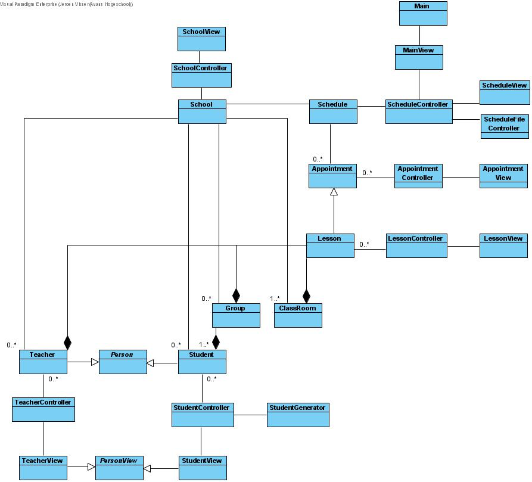
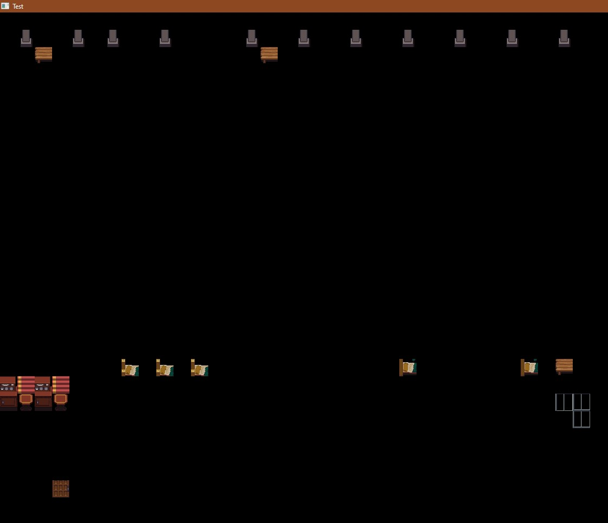
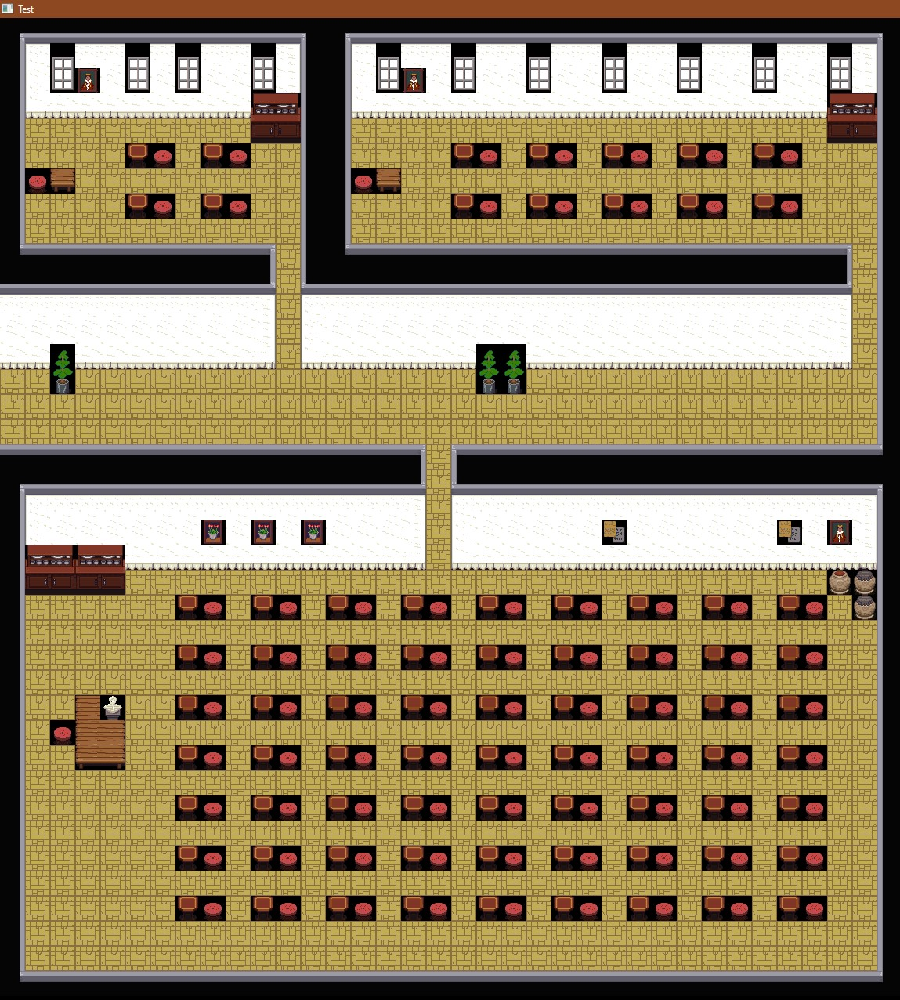

# Tom Martens
Studentnummer: 2168204
<br/>Groep: B1

## Inhoud
1. Week 3
2. Week 4
3. Week 5
4. Week 6
5. Week 7
6. Week 8

## Week 3
Deze week heb ik samen met Casper gewerkt aan de main view en onze oude code van week 2 verbeterd. 
Om de main view uit te leggen wat wij hebben gedaan gaan we eerst naar de code van week 2 kijken. 
Wij hadden de taak gekregen om in het klassendiagram hieronder de Group, Classroom, School en Appointment klassen uit te werken. 
Al hoefde we alleen maar Group, School en Classroom uit te werken. 
Aangezien Luuk en Lieselotte onze Appointment hadden overgenomen aangezien ze al bezig waren met de rooster klassen daar. 



 Casper en ik hadden in het begin nog wat problemen hoe we het moesten programeren maar uiteindelijk hadden we een idee wat we moesten doen. 
 Het probleem wat we hadden was waar we de stage gingen laten zien. 
 Eerst hadden we het idee om de view klassen Aplication te laten extenden en zo iets zichtbaars krijgen. Maar dat kon natuurlijk niet. 
 Daarna lieten we de View klassen een stage laten maken. 
 En in die klassen stage.show Laten doen. Maar na wat overleg met de hele groep waren we er achter gekomen wat de echte bedoeling was. 
 We moesten View een stage laten bouwen. En daarna in de controller stage.show doen. 
 Het uiteindelijke rezultaat zag er dan zo uit.

### Controller klasse voorbeeld
```java
public class GroupController implements Controller {
    private Group group;
    private GroupView groupView;

    public GroupController(Group group) {
        this.group = group;
        this.groupView = new GroupView(group);
    }

    public GroupView getGroupView() {
        return groupView;
    }

    @Override
    public void show() {
        groupView.getStage().show();
    }
}
```
### View klasse voorbeeld
```java
public class GroupView implements View {
    private Group group;

    public GroupView(Group group) {
        this.group = group;
    }

    @Override
    public Stage getStage() {
        //Create complete stage
        return stage;
    }

}
```
Deze structuur hebben wij voor al onze klassen toegepast. Later zou het verbeterd worden maar dit is de basis. 
Deze week 3 hadden wij ook de taak gekregen om dit voor de MainView te doen. En dit leverde veel problemen op. 
De grootste problemen waren dat de main view alle klassen samen voegde en iedereen een andere code structuur en methodes had gebruikt. 
Waar het verwijderen en toevoegen van Sommige classes werkte, werkte het bij andere niet. 
Dit was een gigantisch leermoment en in de toekomst voordat we gingen programmeren maken we afspraken hoe iets behoord te werken en is gemaakt.

## Week 4
Deze week en week 5 heb ik weinig aan code gedaan. 
Jeroen en Luuk waren vooral bezig met het echte verbeteren van de Code die zo slecht samen paste de week hiervoor. 
Ik zelf heb samen met Jochem deze week de eind tiled map getekend in tiled. En deze heeft Casper en Lieselotte ingelezen.
Jochem en ik hadden eest in photoshop zelf een tile set gemaakt. En daarna in tiled een map mee geshilderd met zo logishe mogelijke lagen.
Hoe de map er in het eindproduct uit ziet is hoe wij het hebben getekend. 

## Week 5
Deze week heb ik ook niet echt veel meegeholpen met het programeren. Ik en Jochem hebben Casper geholpen met het inladen van de Tiled map. 
Daar hadden zij nog wat problemen mee. We hadden heel wat problemen gevonden. Grotendeels lagen aan de indexen van de tileset. 
We kwamen erachter dat elke keer dat ons programma een tile probeerde te pakken dat Hij er net een tile naast zat. 
En dus iets verkeerds tekende.

###index probleem

(zo als je kan zien wordt er ook maar 1 layer getekend, de bovenste window layer)  
Na dat we dit probleem hadden opgelost kregen we zo iets:

###Layer probleem

Zo als je kan zien zijn er zwarte vlekken onder de stoelen bijvoorbeeld. Dit komt doordat er maar een layer wordt getekend. 
En die ene layer tekend dus alleen maar boven de andere layers die al uitgelezen waren. Dit probleem kregen wij maar niet opgelost. 
En da dat wij Luuk er bij hadden gehaald heeft hij er voor gezocht dat lagen boven elkaar worden getekend. en niet inplaats van elkaar.

## Week 6
Deze week bevatte de NPC-klasse. Iets daar Lieselotte en ik ten eerste samen aan hebben gewerkt maar ik later in principe tot mijzelf heb geclaimd.  
In principe werkt NPC hetzelfde als in de les is uitgelegd. We hebben een update die de positie bijhoud en een draw die het poppetje tekent.


## Week 7

## Week 8